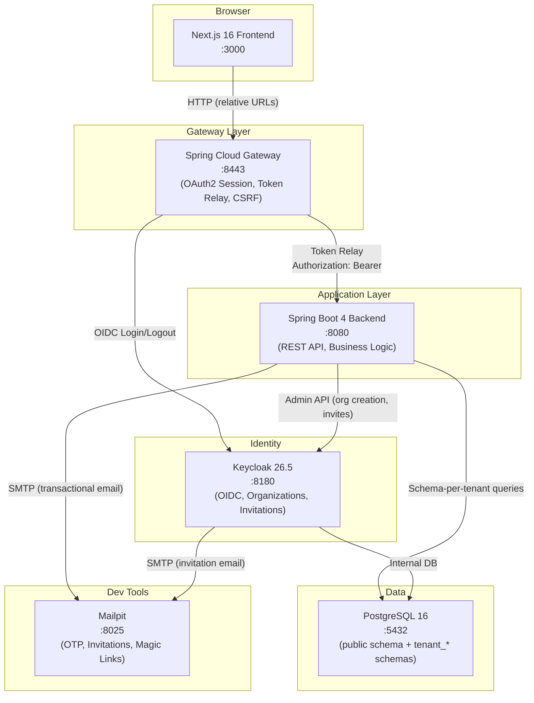
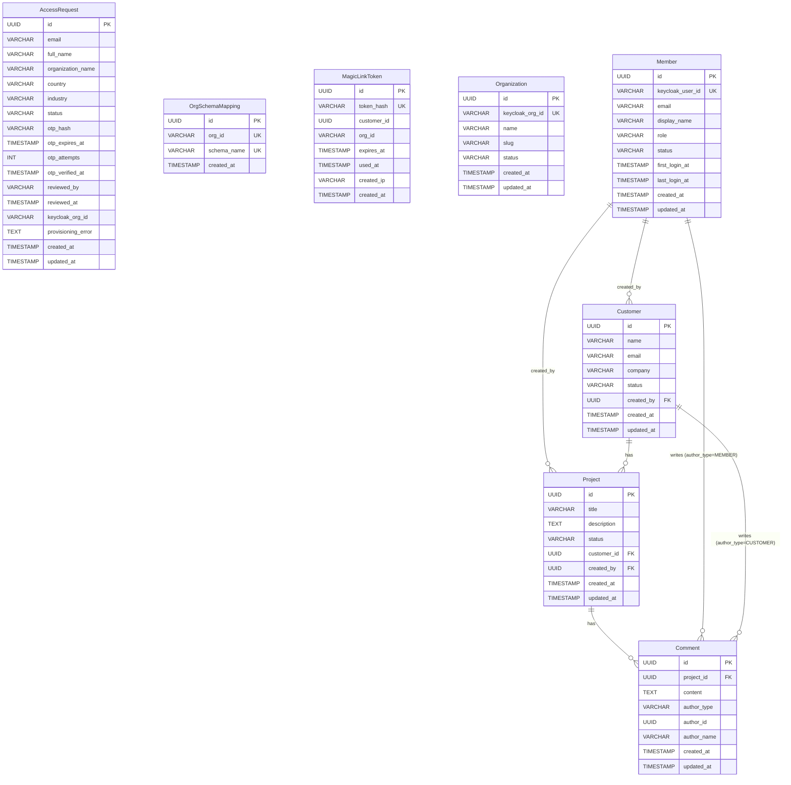
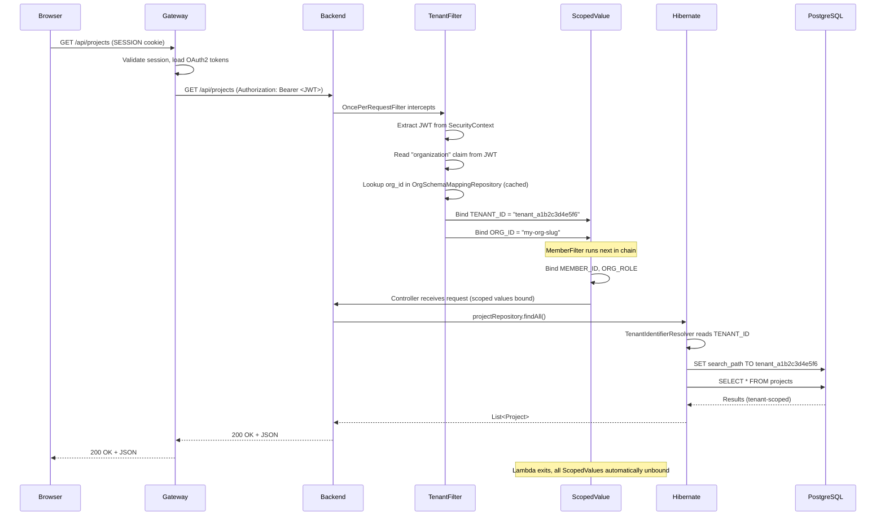
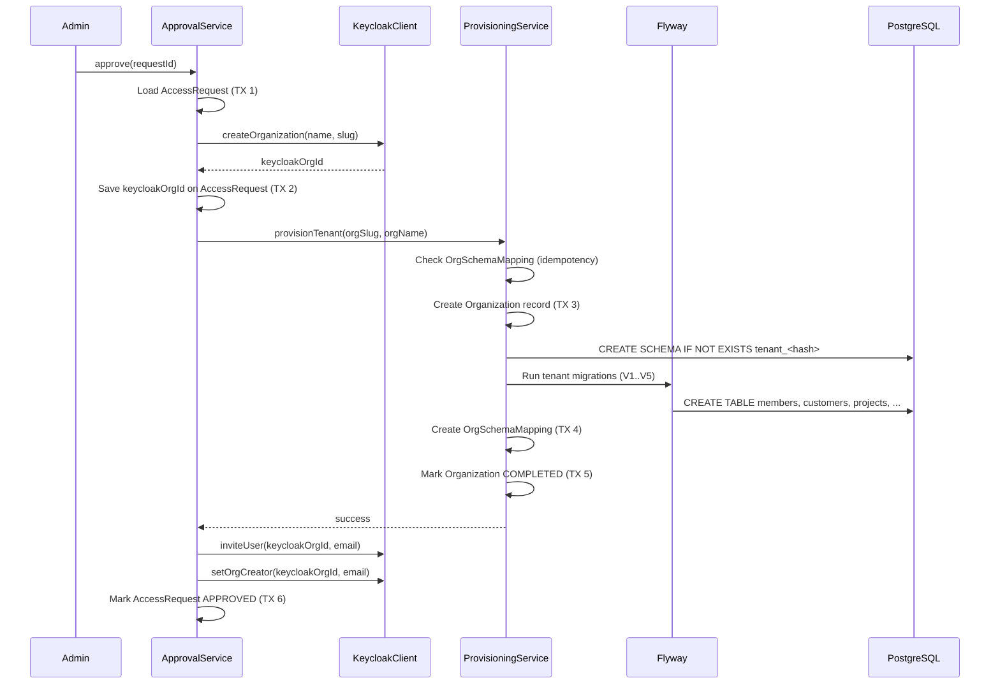
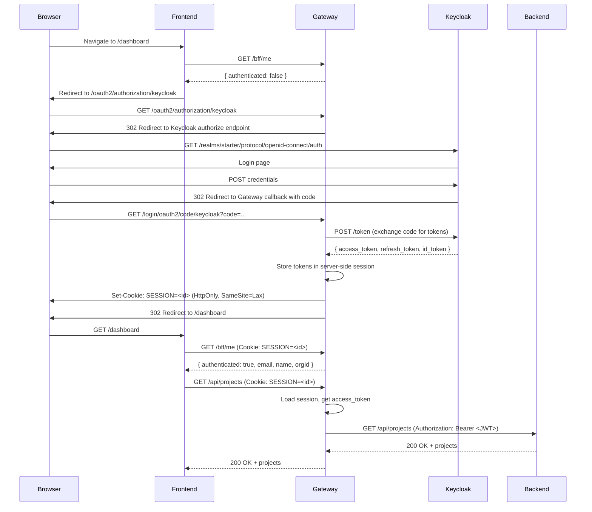
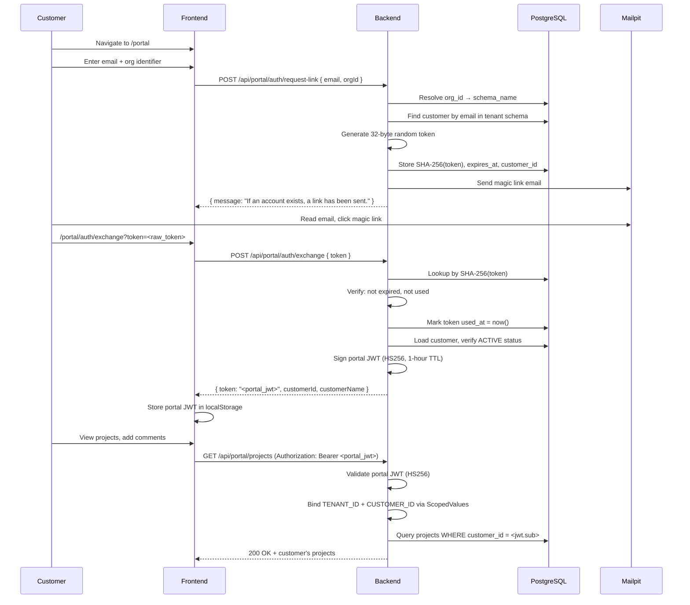
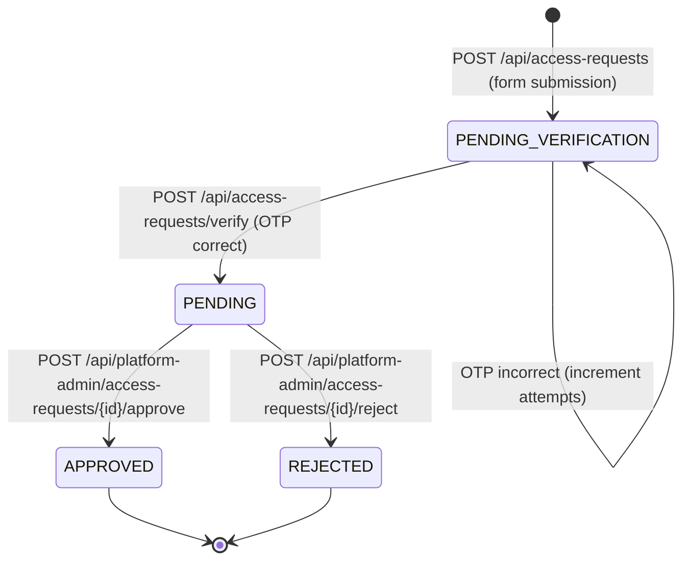
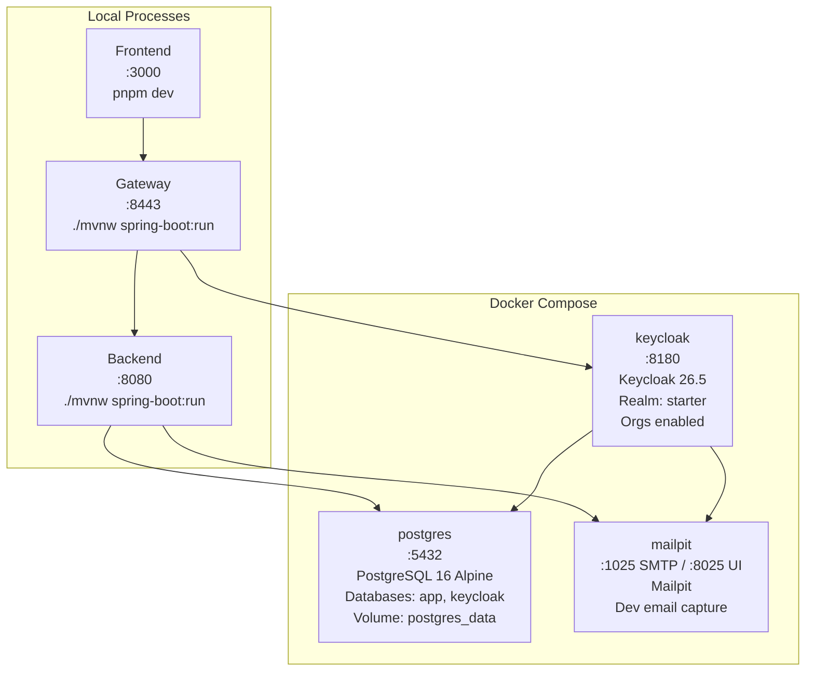

# Architecture: java-keycloak-multitenant-saas

> Standalone multitenant SaaS starter template — Java 25, Spring Boot 4, Keycloak 26.5, Spring Cloud Gateway, Next.js 16

---

## 1. Overview

### 1.1 What This Template Is

`java-keycloak-multitenant-saas` is a production-grade, opinionated starter template for building multitenant B2B SaaS applications. It provides a complete vertical slice through the hardest problems in multitenant SaaS: tenant isolation, identity management, gated registration, and multi-auth portal access.

The template is **not** a framework or a library. It is a fully working application with 8 entities, 3 authentication mechanisms, and a meaningful domain model (Projects, Customers, Comments) that demonstrates every pattern you need to build your own SaaS product on top of it.

**Who it's for:**
- Senior engineers evaluating multitenant architectures
- Teams starting new B2B SaaS products who want proven patterns, not guesswork
- Developers following the companion "Zero to Prod" blog series who want to build along

### 1.2 Architecture Principles

1. **Schema-per-tenant isolation** — Each tenant gets a dedicated PostgreSQL schema. No `WHERE tenant_id = ?` clauses, no row-level security policies, no accidental cross-tenant leaks. Hibernate routes every query to the correct schema automatically.

2. **BFF pattern** — The frontend never sees a JWT. Spring Cloud Gateway manages the OAuth2 session, stores tokens server-side, and relays them to the backend. The browser only holds an HttpOnly session cookie.

3. **ScopedValues over ThreadLocal** — Java 25 ScopedValues (JEP 506, final) propagate request context (tenant ID, member ID, role) through the call stack. Unlike ThreadLocal, they are immutable within their scope, automatically cleaned up, and safe for virtual threads.

4. **Virtual threads from day one** — `spring.threads.virtual.enabled=true`. Every request handler runs on a virtual thread. Combined with ScopedValues, this gives us lightweight concurrency without the ThreadLocal pitfalls.

5. **Three auth mechanisms, one application** — Keycloak OIDC for members, platform admin detection via group membership, and HS256 portal JWTs for customer magic links. Each mechanism is isolated, independently testable, and clearly bounded.

6. **Idempotent everything** — Every step in the provisioning pipeline, every migration, every state transition can be retried safely. Partial failures are recoverable.

### 1.3 System Context Diagram



### 1.4 Service Map

| Service | Port | Technology | Responsibility |
|---------|------|-----------|----------------|
| Frontend | 3000 | Next.js 16 (App Router) | UI rendering, BFF integration, route groups |
| Gateway | 8443 | Spring Cloud Gateway (WebMVC) | OAuth2 session, CSRF, token relay, BFF endpoints |
| Backend | 8080 | Spring Boot 4 (Java 25) | REST API, business logic, schema routing, provisioning |
| Keycloak | 8180 | Keycloak 26.5 | OIDC provider, organizations, invitations, user management |
| PostgreSQL | 5432 | PostgreSQL 16 | Application data (public + tenant schemas), Keycloak data |
| Mailpit | 8025 (UI) / 1025 (SMTP) | Mailpit | Development email capture for OTP, invitations, magic links |

---

## 2. Domain Model

### 2.1 Entity Relationship Diagram



### 2.2 Schema Separation

The domain model is split across two schema types:

**Public schema** (shared, single instance) — contains cross-tenant infrastructure:
- `access_requests` — registration pipeline state machine
- `org_schema_mappings` — the Keycloak org ID to PostgreSQL schema name registry
- `magic_link_tokens` — portal authentication tokens (hashed, single-use)

**Tenant schema** (one per tenant, e.g. `tenant_a1b2c3d4e5f6`) — contains all business data:
- `organizations` — tenant metadata (name, slug, status)
- `members` — users within the tenant, synced from Keycloak
- `customers` — external parties the tenant works with
- `projects` — work items linked to customers
- `comments` — dual-author comments on projects (members + customers)

This separation means tenant data is physically isolated. There are no `tenant_id` columns anywhere in the tenant schema — the schema boundary **is** the isolation mechanism.

### 2.3 Entity Field Tables

#### AccessRequest (Public Schema)

| Field | Type | Constraints | Notes |
|-------|------|-------------|-------|
| `id` | UUID | PK, auto-generated | |
| `email` | VARCHAR(255) | NOT NULL | Requester's email |
| `full_name` | VARCHAR(255) | NOT NULL | |
| `organization_name` | VARCHAR(255) | NOT NULL | Desired org name |
| `country` | VARCHAR(100) | | ISO country selection |
| `industry` | VARCHAR(100) | | Industry vertical selection |
| `status` | VARCHAR(20) | NOT NULL, DEFAULT 'PENDING_VERIFICATION' | State machine: PENDING_VERIFICATION -> PENDING -> APPROVED/REJECTED |
| `otp_hash` | VARCHAR(255) | | BCrypt hash of 6-digit OTP; never store raw |
| `otp_expires_at` | TIMESTAMP | | OTP validity window (configurable, default 10 min) |
| `otp_attempts` | INT | DEFAULT 0 | Brute-force protection counter |
| `otp_verified_at` | TIMESTAMP | | Set when OTP is successfully verified |
| `reviewed_by` | VARCHAR(255) | | Platform admin who approved/rejected |
| `reviewed_at` | TIMESTAMP | | When the review action occurred |
| `keycloak_org_id` | VARCHAR(255) | | Set during provisioning (Keycloak org UUID) |
| `provisioning_error` | TEXT | | Captures failure details for debugging |
| `created_at` | TIMESTAMP | NOT NULL | |
| `updated_at` | TIMESTAMP | NOT NULL | |

#### OrgSchemaMapping (Public Schema)

| Field | Type | Constraints | Notes |
|-------|------|-------------|-------|
| `id` | UUID | PK, auto-generated | |
| `org_id` | VARCHAR(255) | UNIQUE, NOT NULL | Keycloak organization alias (from JWT `organization` claim) |
| `schema_name` | VARCHAR(255) | UNIQUE, NOT NULL | PostgreSQL schema name (e.g. `tenant_a1b2c3d4e5f6`) |
| `created_at` | TIMESTAMP | NOT NULL | Created last during provisioning (commit marker) |

**Why `org_id` stores the Keycloak alias, not the UUID:** Keycloak JWTs include the organization *alias* (slug) in the `organization` claim, not the internal UUID. The mapping must match what appears in the JWT for tenant resolution to work.

#### MagicLinkToken (Public Schema)

| Field | Type | Constraints | Notes |
|-------|------|-------------|-------|
| `id` | UUID | PK, auto-generated | |
| `token_hash` | VARCHAR(255) | UNIQUE, NOT NULL | SHA-256 hash of raw token; raw token never stored |
| `customer_id` | UUID | NOT NULL | Customer this token authenticates |
| `org_id` | VARCHAR(255) | NOT NULL | Keycloak org alias (determines tenant schema) |
| `expires_at` | TIMESTAMP | NOT NULL | 15-minute TTL from creation |
| `used_at` | TIMESTAMP | | Set on first exchange; enables single-use enforcement |
| `created_ip` | VARCHAR(45) | | Requester IP for rate-limit auditing |
| `created_at` | TIMESTAMP | NOT NULL | |

#### Organization (Tenant Schema)

| Field | Type | Constraints | Notes |
|-------|------|-------------|-------|
| `id` | UUID | PK, auto-generated | |
| `keycloak_org_id` | VARCHAR(255) | UNIQUE, NOT NULL | Links to Keycloak org |
| `name` | VARCHAR(255) | NOT NULL | Display name |
| `slug` | VARCHAR(100) | NOT NULL | URL-safe identifier |
| `status` | VARCHAR(20) | NOT NULL, DEFAULT 'IN_PROGRESS' | IN_PROGRESS -> COMPLETED / FAILED |
| `created_at` | TIMESTAMP | NOT NULL | |
| `updated_at` | TIMESTAMP | NOT NULL | |

#### Member (Tenant Schema)

| Field | Type | Constraints | Notes |
|-------|------|-------------|-------|
| `id` | UUID | PK, auto-generated | |
| `keycloak_user_id` | VARCHAR(255) | UNIQUE, NOT NULL | Keycloak `sub` claim |
| `email` | VARCHAR(255) | NOT NULL | Synced from Keycloak on each login |
| `display_name` | VARCHAR(255) | | Synced from Keycloak |
| `role` | VARCHAR(20) | NOT NULL | `owner` or `member` — stored in product DB, not Keycloak |
| `status` | VARCHAR(20) | NOT NULL, DEFAULT 'ACTIVE' | ACTIVE or SUSPENDED |
| `first_login_at` | TIMESTAMP | | Set on first authenticated request |
| `last_login_at` | TIMESTAMP | | Updated on each authenticated request |
| `created_at` | TIMESTAMP | NOT NULL | |
| `updated_at` | TIMESTAMP | NOT NULL | |

**Why roles are in the product DB, not Keycloak:** Keycloak organization roles are limited and opaque — you cannot easily query "all owners" from the application, and role changes require Keycloak Admin API calls. Storing roles in the product database gives us query flexibility, audit history, and independence from Keycloak's role model.

#### Customer (Tenant Schema)

| Field | Type | Constraints | Notes |
|-------|------|-------------|-------|
| `id` | UUID | PK, auto-generated | |
| `name` | VARCHAR(255) | NOT NULL | Customer display name |
| `email` | VARCHAR(255) | NOT NULL | Primary contact email (used for magic links) |
| `company` | VARCHAR(255) | | Company/organization name |
| `status` | VARCHAR(20) | NOT NULL, DEFAULT 'ACTIVE' | ACTIVE or ARCHIVED |
| `created_by` | UUID | FK -> members.id | Member who created this customer |
| `created_at` | TIMESTAMP | NOT NULL | |
| `updated_at` | TIMESTAMP | NOT NULL | |

#### Project (Tenant Schema)

| Field | Type | Constraints | Notes |
|-------|------|-------------|-------|
| `id` | UUID | PK, auto-generated | |
| `title` | VARCHAR(255) | NOT NULL | Project name |
| `description` | TEXT | | Optional detailed description |
| `status` | VARCHAR(20) | NOT NULL, DEFAULT 'ACTIVE' | ACTIVE -> COMPLETED -> ARCHIVED |
| `customer_id` | UUID | FK -> customers.id, NOT NULL | Every project belongs to a customer |
| `created_by` | UUID | FK -> members.id | Member who created this project |
| `created_at` | TIMESTAMP | NOT NULL | |
| `updated_at` | TIMESTAMP | NOT NULL | |

#### Comment (Tenant Schema)

| Field | Type | Constraints | Notes |
|-------|------|-------------|-------|
| `id` | UUID | PK, auto-generated | |
| `project_id` | UUID | FK -> projects.id, NOT NULL | Comments belong to projects |
| `content` | TEXT | NOT NULL | Comment body |
| `author_type` | VARCHAR(20) | NOT NULL | Discriminator: `MEMBER` or `CUSTOMER` |
| `author_id` | UUID | NOT NULL | FK -> members.id (if MEMBER) or customers.id (if CUSTOMER) |
| `author_name` | VARCHAR(255) | | Denormalized for display; avoids cross-table join in listing |
| `created_at` | TIMESTAMP | NOT NULL | |
| `updated_at` | TIMESTAMP | NOT NULL | |

**Why `author_type` as a discriminator:** This is the dual-auth write pattern. Members comment from the tenant app (Keycloak auth), customers comment from the magic link portal (portal JWT auth). Both land in the same `comments` table. The discriminator tells us which auth context produced the comment, and `author_id` is a polymorphic FK — it points to either `members.id` or `customers.id` depending on `author_type`. This avoids two separate comment tables and keeps the comment timeline unified.

---

## 3. Multitenancy Architecture

### 3.1 Schema-Per-Tenant Deep Dive

Every tenant in the system gets a dedicated PostgreSQL schema named `tenant_<12-hex-chars>` (e.g., `tenant_a1b2c3d4e5f6`). The schema name is deterministically generated from the Keycloak organization slug using a hash function, ensuring uniqueness without collision risk.

**How it works at the database level:**

```
PostgreSQL Instance
├── public schema
│   ├── access_requests
│   ├── org_schema_mappings
│   ├── magic_link_tokens
│   └── flyway_schema_history (public migrations)
├── tenant_a1b2c3d4e5f6 schema
│   ├── organizations
│   ├── members
│   ├── customers
│   ├── projects
│   ├── comments
│   └── flyway_schema_history (tenant migrations)
├── tenant_c3d4e5f6a1b2 schema
│   ├── organizations
│   ├── members
│   ├── ... (same structure)
│   └── flyway_schema_history
└── keycloak schema (Keycloak internal)
```

Each tenant schema has identical table structure — the same Flyway migrations run against every schema. When a SQL query executes, PostgreSQL's `search_path` determines which schema the unqualified table names resolve to. Hibernate sets this per-connection.

**Why schema-per-tenant over row-level isolation:**

| Concern | Row-Level (tenant_id column) | Schema-Per-Tenant |
|---------|------------------------------|-------------------|
| Isolation guarantee | Application-enforced (one missed WHERE = data leak) | Database-enforced (physically separate) |
| Query complexity | Every query needs `WHERE tenant_id = ?` | Standard queries, no tenant filter |
| Index overhead | Composite indexes on (tenant_id, ...) everywhere | Standard single-column indexes |
| Backup/restore | Cannot restore single tenant without surgery | Backup/restore individual schemas |
| Compliance | Must prove row-level filtering is airtight | Physical separation is self-evident |
| Migration complexity | Single migration run | Migration per schema (automated) |
| Scalability ceiling | Single schema with very large tables | Each schema stays small; can shard later |

The primary trade-off is migration time: adding a column requires running the migration against every tenant schema. For a starter template, this is acceptable — and the migration runner handles it automatically.

### 3.2 Request Lifecycle



### 3.3 ScopedValues (Java 25 JEP 506)

ScopedValues are Java 25's replacement for ThreadLocal in request-scoped contexts. They solve three problems that ThreadLocal cannot:

1. **Immutability within scope** — Once bound, a ScopedValue cannot be changed within its scope. This prevents subtle bugs where middleware accidentally overwrites context set by an earlier filter.

2. **Automatic cleanup** — ScopedValues are bound within a lambda (`ScopedValue.where(key, val).run(() -> ...)`). When the lambda exits, the binding is automatically removed. No `try/finally` cleanup, no `ThreadLocal.remove()` that someone forgets to call.

3. **Virtual thread safety** — ThreadLocal has a per-thread cost: every virtual thread that touches a ThreadLocal allocates storage for it. ScopedValues have zero per-thread overhead — they're inherited structurally through the call stack.

**The template binds these ScopedValues per request:**

```java
public final class RequestScopes {

    /** Tenant schema name (e.g., "tenant_a1b2c3d4e5f6"). Bound by TenantFilter. */
    public static final ScopedValue<String> TENANT_ID = ScopedValue.newInstance();

    /** Keycloak org ID/alias. Bound by TenantFilter. */
    public static final ScopedValue<String> ORG_ID = ScopedValue.newInstance();

    /** Current member's UUID within the tenant. Bound by MemberFilter. */
    public static final ScopedValue<UUID> MEMBER_ID = ScopedValue.newInstance();

    /** Current member's org role ("owner" or "member"). Bound by MemberFilter. */
    public static final ScopedValue<String> ORG_ROLE = ScopedValue.newInstance();

    /** Authenticated customer's UUID. Bound by PortalAuthFilter for portal requests. */
    public static final ScopedValue<UUID> CUSTOMER_ID = ScopedValue.newInstance();

    // Convenience methods
    public static UUID requireMemberId() { ... }
    public static String requireTenantId() { ... }
    public static void requireOwner() { ... }
    public static boolean isPlatformAdmin() { ... }
}
```

**Binding in the filter chain:**

```java
// TenantFilter binds tenant context, then continues the chain inside the scope
ScopedValue.where(RequestScopes.TENANT_ID, schemaName)
    .where(RequestScopes.ORG_ID, orgId)
    .run(() -> filterChain.doFilter(request, response));
// All downstream filters, controllers, services, and Hibernate see these values
// When run() returns, the values are automatically unbound
```

The `ScopedFilterChain` utility bridges ScopedValue's `Runnable`-based API with the servlet filter chain's checked exceptions (`IOException`, `ServletException`), wrapping and unwrapping them.

### 3.4 OrgSchemaMapping as Registry

`OrgSchemaMapping` is the single source of truth for which Keycloak organization maps to which PostgreSQL schema. It lives in the public schema and is:

- **Created last during provisioning** — The schema, migrations, and organization record are all created before the mapping. This makes the mapping a "commit marker": if the mapping exists, the tenant is fully provisioned.
- **Cached with Caffeine** — 5-minute TTL, 10,000 max entries. On every authenticated request, the TenantFilter checks this cache before hitting the database.
- **Immutable after creation** — An org-to-schema mapping never changes. If you need to migrate a tenant to a different schema, you create a new mapping and delete the old one.

### 3.5 Schema Provisioning Pipeline (`TenantProvisioningService`)

The provisioning pipeline creates a new tenant schema from scratch. This service is called by `AccessRequestApprovalService` (Section 5.1) as part of the broader approval flow. Every step is idempotent — if the pipeline fails halfway and is retried, it picks up where it left off.

**`TenantProvisioningService` steps (schema + data only — does NOT create Keycloak org or invite users):**

| Step | Operation | Idempotency Guard | Transaction |
|------|-----------|-------------------|-------------|
| 1 | Check if `OrgSchemaMapping` already exists | Early return if found | Read-only |
| 2 | Create Organization record, mark `IN_PROGRESS` | `findOrCreate` by keycloak_org_id | Short TX |
| 3 | Generate schema name from org slug | Deterministic hash function | None |
| 4 | `CREATE SCHEMA IF NOT EXISTS <schema>` | SQL `IF NOT EXISTS` | DDL (auto-commit) |
| 5 | Run Flyway tenant migrations | Flyway tracks completed migrations | Flyway-managed |
| 6 | Create `OrgSchemaMapping` | Unique constraint on org_id | Short TX |
| 7 | Mark Organization `COMPLETED` | Status update | Short TX |

**Why no single wrapping transaction:** Step 5 (Flyway migrations) needs its own database connections with the tenant schema on the search path. An outer transaction would force Flyway to reuse a connection bound to the public schema, causing "relation does not exist" errors. Instead, each step manages its own transaction boundary via `TransactionTemplate`.

**Error handling:** If any step fails, the Organization record's `provisioning_error` field captures the error message, and the status remains `IN_PROGRESS`. The next retry attempt will skip completed steps (idempotent) and resume from the failure point.



---

## 4. Authentication & Authorization

The template implements three distinct authentication mechanisms, each serving a different user type and access pattern.

### 4.1 Mechanism 1: Gateway Session (Keycloak OIDC)

**Who:** Tenant members (employees) accessing the main application.

**How:** Standard OAuth2 Authorization Code flow via Spring Cloud Gateway.

1. User clicks "Login" in the frontend
2. Frontend redirects to Gateway's OAuth2 login endpoint
3. Gateway redirects to Keycloak's authorization endpoint
4. User authenticates with Keycloak (username/password, or Keycloak's registration)
5. Keycloak redirects back to Gateway with an authorization code
6. Gateway exchanges the code for access + refresh + ID tokens
7. Gateway stores tokens in a server-side session (Spring Session JDBC)
8. Gateway sets an `SESSION` HttpOnly cookie on the browser
9. Frontend polls `/bff/me` to confirm authentication state

**On subsequent requests:**
- Browser sends `SESSION` cookie automatically
- Gateway loads the session, retrieves the stored access token
- Gateway adds `Authorization: Bearer <access_token>` header via TokenRelay filter
- Backend validates the JWT (signature, expiry, issuer)

**Key security property:** The browser never sees the JWT. It only holds an HttpOnly session cookie. This means XSS attacks cannot steal the access token.



### 4.2 Mechanism 2: Backend JWT Validation

**Who:** The backend, validating tokens relayed by the gateway.

The backend is configured as a Spring Security OAuth2 Resource Server. It validates every incoming JWT against Keycloak's JWKS endpoint:

- **Signature:** RS256, verified against Keycloak's public key set
- **Issuer:** Must match the Keycloak realm URL
- **Expiry:** Must not be expired
- **Organization claim:** Extracted to determine tenant context

The backend never initiates an OAuth2 flow — it only validates tokens passed to it by the gateway.

### 4.3 Mechanism 3: Portal JWT (HS256, Magic Links)

**Who:** External customers accessing the customer portal.

This is a completely separate auth mechanism from Keycloak. The backend issues its own JWTs for portal access:

- **Algorithm:** HS256 (symmetric, server-side secret)
- **Secret:** Configurable via `PORTAL_JWT_SECRET` environment variable
- **TTL:** 1 hour
- **Claims:** `sub` (customer UUID), `org_id` (Keycloak org alias), `type: "customer"`
- **Validation:** Backend validates portal JWTs on all `/api/portal/**` endpoints

Portal JWTs are issued after a magic link token exchange (see Section 5.3). They are intentionally separate from Keycloak JWTs because:
1. Customers are not Keycloak users — they don't have accounts in the identity provider
2. Magic link auth is stateless (no session) — the JWT is the only credential
3. Portal JWTs are scoped to a specific customer within a specific tenant



### 4.4 Platform Admin Detection

Platform admins are a cross-tenant concept — they manage access requests, approve new tenants, and monitor the platform. Platform admin status is determined by Keycloak group membership:

1. **Bootstrap:** The `keycloak-bootstrap.sh` script creates a `platform-admins` group in the `starter` realm and adds the initial admin user to it.
2. **JWT claim:** Keycloak is configured to include the `groups` claim in access tokens. If a user is in the `platform-admins` group, their JWT contains `"groups": ["platform-admins"]`.
3. **Backend check:** `PlatformSecurityService.isPlatformAdmin()` reads the JWT `groups` claim and checks for the `platform-admins` entry.
4. **Orthogonal to tenant roles:** A user can be both a platform admin and an owner/member of a tenant. The two concerns are independent.

### 4.5 RBAC: Owner vs. Member

The template uses a simple two-role model stored in the product database:

| Action | Owner | Member |
|--------|-------|--------|
| View dashboard, projects, customers, comments | Yes | Yes |
| Create/edit projects and customers | Yes | Yes |
| Add comments | Yes | Yes |
| Invite members | Yes | No |
| Remove members | Yes | No |
| Change member roles | Yes | No |
| View/edit settings | Yes | No |
| Share portal links | Yes | Yes |

Role assignment:
- The user who created the organization (via access request approval) is assigned `owner`
- All invited members are assigned `member`
- Owners can promote members to `owner` or demote owners to `member`

---

## 5. Core Flows

### 5.1 Tenant Registration

The registration flow is intentionally gated behind platform admin approval. There is no self-service signup — every new tenant is reviewed by a human before infrastructure is provisioned.

**Full flow:**

```
Visitor fills form → OTP email → Visitor verifies OTP → Request enters PENDING queue
→ Platform admin reviews → Approve → Provision Keycloak org + tenant schema + invite
→ Invitee receives email → Registers with Keycloak → First login → Member sync creates owner record
```

**State machine for AccessRequest:**



**Full approval pipeline (`AccessRequestApprovalService` — orchestrates Keycloak + `TenantProvisioningService`):**

| Step | Action | Idempotent? | Notes |
|------|--------|------------|-------|
| 1 | Create Keycloak organization (name + slug) | Yes — Keycloak returns existing if already created | Keycloak Admin REST API |
| 2 | Persist `keycloak_org_id` on AccessRequest | Yes — update is idempotent | Short transaction |
| 3 | Create PostgreSQL schema | Yes — `CREATE SCHEMA IF NOT EXISTS` | DDL auto-commit |
| 4 | Run Flyway tenant migrations | Yes — Flyway tracks completed migrations | Per-migration tracking |
| 5 | Create Organization record in tenant schema | Yes — `findOrCreate` pattern | Short transaction |
| 6 | Create OrgSchemaMapping (commit marker) | Yes — unique constraint prevents dupes | Short transaction |
| 7 | Invite requester to Keycloak org | Yes — Keycloak ignores duplicate invites | Keycloak Admin API |

Each step uses its own transaction boundary. If step 4 fails, steps 1-3 are already committed and will be skipped on retry (idempotency guards). The OrgSchemaMapping (step 6) is created last because it is the gate that allows TenantFilter to resolve requests to this tenant. Until it exists, no requests can reach the tenant schema.

### 5.2 Member Invitation & Sync

**Invitation flow:**

1. Owner calls `POST /api/members/invite` with invitee email
2. Backend calls Keycloak Admin API to send organization invitation
3. Keycloak sends invitation email (via Mailpit in dev)
4. Invitee clicks invitation link → Keycloak registration page
5. Invitee creates account → Keycloak redirects to app → Gateway creates session
6. First authenticated request hits MemberFilter → no member record found
7. MemberSyncService creates member record from JWT claims:
   - `keycloak_user_id` = JWT `sub` claim
   - `email` = JWT `email` claim
   - `display_name` = JWT `name` claim
   - `role` = `member` (invited users are always members)
   - `first_login_at` = now

**Profile sync on subsequent logins:**

On every authenticated request, MemberFilter checks the member cache. On cache miss (first request of the session), it syncs identity fields (email, display_name) from the JWT in case they changed in Keycloak. It does **not** sync the role — role changes go through the dedicated `PATCH /api/members/{id}/role` endpoint.

**Org creator flow:**

The first user in a tenant (the person who submitted the access request) is marked as the org creator in Keycloak during approval. On their first login, MemberSyncService detects the creator flag and assigns the `owner` role instead of `member`.

### 5.3 Customer Portal Access

The customer portal provides read-only access to projects and the ability to add comments, without requiring customers to have Keycloak accounts.

**Flow:**

1. Member clicks "Share Portal Link" on a project page
2. Backend sends magic link email to the customer's email address
3. Customer clicks the magic link → frontend portal page
4. Frontend exchanges the token for a portal JWT
5. Customer can view their projects and add comments

**Magic link security properties:**
- Token: 32 bytes of `SecureRandom` output, Base64-URL encoded
- Storage: Only SHA-256 hash stored in database (raw token never persisted)
- TTL: 15 minutes from generation
- Single-use: `used_at` column set on first exchange; subsequent attempts rejected
- Rate limit: Maximum 3 tokens per customer per 5 minutes
- Email enumeration prevention: All responses are generic ("If an account exists, a link has been sent")

**Dual-auth writes:**

When a customer adds a comment through the portal, the backend:
1. Validates the portal JWT
2. Extracts `customer_id` from the JWT `sub` claim
3. Binds `CUSTOMER_ID` ScopedValue
4. Creates a Comment with `author_type=CUSTOMER`, `author_id=<customer_id>`

When a member adds a comment through the tenant app, the backend:
1. Validates the Keycloak JWT (via gateway session)
2. Reads `MEMBER_ID` from ScopedValues
3. Creates a Comment with `author_type=MEMBER`, `author_id=<member_id>`

Both comments land in the same table. The UI renders them with different badges (e.g., "Team" vs. "Client") based on `author_type`.

### 5.4 Domain CRUD (Projects, Customers, Comments)

All domain entities follow the same tenant-scoped CRUD pattern:

1. Request arrives at the backend with a valid JWT
2. TenantFilter resolves the org claim → schema name, binds `TENANT_ID` ScopedValue
3. MemberFilter resolves the user → member record, binds `MEMBER_ID` ScopedValue
4. Controller calls service method
5. Service calls repository
6. Hibernate's `TenantIdentifierResolver` reads `TENANT_ID` ScopedValue
7. Hibernate's `MultiTenantConnectionProvider` sets `search_path` to the tenant schema
8. Query executes against the tenant's tables — no `WHERE tenant_id = ?` needed

**This means every JPA query is automatically tenant-scoped.** A `findAll()` in the ProjectRepository returns only the current tenant's projects. There is no way to accidentally query across tenants because the database connection itself is scoped to the tenant schema.

---

## 6. API Surface

### 6.1 Public Endpoints (Unauthenticated)

| Method | Path | Description | Notes |
|--------|------|-------------|-------|
| POST | `/api/access-requests` | Submit registration request | Generates OTP, sends email |
| POST | `/api/access-requests/verify` | Verify OTP | Transitions to PENDING |
| POST | `/api/portal/auth/request-link` | Request magic link | Generic response (anti-enumeration) |
| POST | `/api/portal/auth/exchange` | Exchange token for portal JWT | Single-use token consumption |
| GET | `/bff/me` | Session status | Returns auth state (via gateway) |
| GET | `/bff/csrf` | CSRF token | Returns token for mutations (via gateway) |

### 6.2 Platform Admin Endpoints

All require authentication **and** `platform-admins` group membership.

| Method | Path | Description | Notes |
|--------|------|-------------|-------|
| GET | `/api/platform-admin/access-requests` | List access requests | Optional `?status=` filter |
| POST | `/api/platform-admin/access-requests/{id}/approve` | Approve request | Triggers full provisioning pipeline |
| POST | `/api/platform-admin/access-requests/{id}/reject` | Reject request | Records reviewer + timestamp |

### 6.3 Tenant App Endpoints (Authenticated Members)

All require authentication and a valid tenant context (org claim in JWT → schema mapping exists).

| Method | Path | Description | Auth | Role |
|--------|------|-------------|------|------|
| GET | `/api/members` | List members | Member+ | Any |
| GET | `/api/members/me` | Current member profile | Member+ | Any |
| POST | `/api/members/invite` | Invite by email | Member+ | Owner |
| DELETE | `/api/members/{id}` | Remove member | Member+ | Owner |
| PATCH | `/api/members/{id}/role` | Change role | Member+ | Owner |
| GET | `/api/customers` | List customers | Member+ | Any |
| GET | `/api/customers/{id}` | Customer detail | Member+ | Any |
| POST | `/api/customers` | Create customer | Member+ | Any |
| PUT | `/api/customers/{id}` | Update customer | Member+ | Any |
| DELETE | `/api/customers/{id}` | Archive customer | Member+ | Any |
| GET | `/api/projects` | List projects | Member+ | Any |
| GET | `/api/projects/{id}` | Project detail (with customer) | Member+ | Any |
| POST | `/api/projects` | Create project | Member+ | Any |
| PUT | `/api/projects/{id}` | Update project | Member+ | Any |
| PATCH | `/api/projects/{id}/status` | Change status | Member+ | Any |
| DELETE | `/api/projects/{id}` | Archive project | Member+ | Any |
| GET | `/api/projects/{id}/comments` | List comments | Member+ | Any |
| POST | `/api/projects/{id}/comments` | Add comment (MEMBER) | Member+ | Any |
| DELETE | `/api/comments/{id}` | Delete own comment | Member+ | Any |

### 6.4 Portal Endpoints (Portal JWT)

All require a valid portal JWT (HS256, issued by backend).

| Method | Path | Description | Scope |
|--------|------|-------------|-------|
| GET | `/api/portal/projects` | List customer's projects | Scoped to JWT customer_id |
| GET | `/api/portal/projects/{id}` | Project detail | Must belong to JWT customer |
| GET | `/api/portal/projects/{id}/comments` | List project comments | Must belong to JWT customer |
| POST | `/api/portal/projects/{id}/comments` | Add comment (CUSTOMER) | author_type = CUSTOMER |

### 6.5 Key Request/Response Shapes

**Submit Access Request:**
```json
// POST /api/access-requests
// Request:
{
  "email": "alice@acme.com",
  "fullName": "Alice Johnson",
  "organizationName": "Acme Corp",
  "country": "ZA",
  "industry": "Consulting"
}
// Response:
{
  "message": "Verification code sent",
  "expiresInMinutes": 10
}
```

**Verify OTP:**
```json
// POST /api/access-requests/verify
// Request:
{ "email": "alice@acme.com", "otp": "482916" }
// Response:
{ "message": "Email verified. Your request is pending review." }
```

**BFF Me (authenticated):**
```json
// GET /bff/me
{
  "authenticated": true,
  "email": "alice@acme.com",
  "name": "Alice Johnson",
  "orgId": "acme-corp",
  "roles": ["owner"]
}
```

**Create Project:**
```json
// POST /api/projects
// Request:
{
  "title": "Website Redesign",
  "description": "Full website redesign for Q2 launch",
  "customerId": "a1b2c3d4-..."
}
// Response:
{
  "id": "e5f6a7b8-...",
  "title": "Website Redesign",
  "description": "Full website redesign for Q2 launch",
  "status": "ACTIVE",
  "customer": { "id": "a1b2c3d4-...", "name": "Beta Industries" },
  "createdBy": { "id": "...", "displayName": "Alice Johnson" },
  "createdAt": "2026-03-29T10:00:00Z"
}
```

**Portal Token Exchange:**
```json
// POST /api/portal/auth/exchange
// Request:
{ "token": "dGhpcyBpcyBhIHRlc3QgdG9rZW4..." }
// Response:
{
  "token": "eyJhbGciOiJIUzI1NiJ9...",
  "customerId": "a1b2c3d4-...",
  "customerName": "Beta Industries"
}
```

---

## 7. Gateway Architecture

### 7.1 Why a Gateway (BFF Pattern)

The template uses Spring Cloud Gateway in WebMVC mode as a Backend-for-Frontend (BFF). This is a deliberate architectural choice driven by security:

**Without a gateway (common SPA pattern):**
- Frontend receives JWTs directly from the identity provider
- Tokens stored in localStorage or memory (vulnerable to XSS)
- Refresh tokens in the browser (theft enables session hijacking)
- CSRF protection is entirely client-side

**With the gateway BFF:**
- Tokens never reach the browser — stored in server-side sessions
- Browser holds only an HttpOnly cookie (not readable by JavaScript)
- Refresh handled server-side (transparent to frontend)
- CSRF enforced at the gateway layer

The security argument is definitive: any XSS vulnerability in the SPA pattern leaks the access token. With BFF, XSS can read page content but cannot steal the session token.

### 7.2 Route Configuration

```yaml
spring:
  cloud:
    gateway:
      mvc:
        routes:
          - id: backend-api
            uri: ${BACKEND_URL:http://localhost:8080}
            predicates:
              - Path=/api/**
            filters:
              - TokenRelay=
```

The `TokenRelay` filter reads the OAuth2 access token from the server-side session and adds it as an `Authorization: Bearer` header on the outbound request to the backend.

**Portal routes** (`/api/portal/**`) pass through the gateway without a session — they carry their own portal JWT. The gateway's authorization rules permit these paths without authentication.

### 7.3 Security Filter Chain

```java
http
    .authorizeHttpRequests(auth -> auth
        // Public endpoints
        .requestMatchers("/", "/error", "/actuator/health", "/bff/me", "/bff/csrf")
            .permitAll()
        // Public registration
        .requestMatchers("/api/access-requests", "/api/access-requests/verify")
            .permitAll()
        // Public portal auth
        .requestMatchers("/api/portal/**")
            .permitAll()
        // Internal endpoints blocked
        .requestMatchers("/internal/**")
            .denyAll()
        // Everything else requires authentication
        .requestMatchers("/api/**")
            .authenticated()
        .anyRequest()
            .authenticated()
    )
    .oauth2Login(oauth2 -> oauth2
        .defaultSuccessUrl(frontendUrl + "/dashboard", true)
    )
    .logout(logout -> logout
        .logoutSuccessHandler(oidcLogoutSuccessHandler())
        .invalidateHttpSession(true)
        .deleteCookies("SESSION")
    )
    .csrf(csrf -> csrf
        .csrfTokenRepository(CookieCsrfTokenRepository.withHttpOnlyFalse())
        .ignoringRequestMatchers("/bff/**")
        // CSRF enforced on /api/** — gateway relays session cookie + CSRF token
    )
    .sessionManagement(session -> session
        .sessionCreationPolicy(SessionCreationPolicy.IF_REQUIRED)
        .sessionFixation(fix -> fix.changeSessionId())
    );
```

### 7.4 BFF Endpoints

The gateway exposes three BFF endpoints that the frontend uses directly:

**GET /bff/me** — Returns current session state:
```json
// Authenticated:
{ "authenticated": true, "email": "alice@acme.com", "name": "Alice", "orgId": "acme-corp" }
// Not authenticated:
{ "authenticated": false }
```

**GET /bff/csrf** — Returns a CSRF token for the frontend to include in mutation requests.

**POST /bff/logout** — Invalidates the session, triggers OIDC back-channel logout with Keycloak, clears the SESSION cookie, and redirects to the landing page.

### 7.5 Session Management

- **Storage:** Spring Session JDBC — sessions stored in PostgreSQL (same `app` database, public schema)
- **Cookie:** `SESSION` (HttpOnly, SameSite=Lax, Secure in production)
- **Timeout:** 8 hours (configurable)
- **Session fixation:** Session ID regenerated on login to prevent fixation attacks

---

## 8. Infrastructure

### 8.1 Docker Compose Service Map



### 8.2 Docker Compose Configuration

```yaml
# compose/docker-compose.yml
services:
  postgres:
    image: postgres:16-alpine
    ports:
      - "5432:5432"
    environment:
      POSTGRES_USER: postgres
      POSTGRES_PASSWORD: changeme
      POSTGRES_DB: app
    volumes:
      - postgres_data:/var/lib/postgresql/data
      - ./data/postgres/init.sql:/docker-entrypoint-initdb.d/init.sql
    healthcheck:
      test: ["CMD-SHELL", "pg_isready -U postgres"]
      interval: 5s
      timeout: 5s
      retries: 5

  keycloak:
    image: quay.io/keycloak/keycloak:26.5
    command: start-dev --import-realm
    ports:
      - "8180:8080"
    environment:
      KC_DB: postgres
      KC_DB_URL: jdbc:postgresql://postgres:5432/keycloak
      KC_DB_USERNAME: postgres
      KC_DB_PASSWORD: changeme
      KC_BOOTSTRAP_ADMIN_USERNAME: admin
      KC_BOOTSTRAP_ADMIN_PASSWORD: ${KC_ADMIN_PASSWORD:-admin}
      KC_FEATURES: organization
    volumes:
      - ./keycloak/realm-export.json:/opt/keycloak/data/import/realm-export.json
    depends_on:
      postgres:
        condition: service_healthy
    healthcheck:
      test: ["CMD-SHELL", "exec 3<>/dev/tcp/localhost/8080 && echo -e 'GET /health/ready HTTP/1.1\r\nHost: localhost\r\n\r\n' >&3 && cat <&3 | grep -q '200'"]
      interval: 10s
      timeout: 5s
      retries: 15
      start_period: 30s

  mailpit:
    image: axllent/mailpit:latest
    ports:
      - "8025:8025"
      - "1025:1025"

volumes:
  postgres_data:
```

**Init SQL (`compose/data/postgres/init.sql`):**
```sql
-- Create the keycloak database (app database is created by POSTGRES_DB env var)
SELECT 'CREATE DATABASE keycloak'
WHERE NOT EXISTS (SELECT FROM pg_database WHERE datname = 'keycloak')\gexec
```

### 8.3 Keycloak Realm Configuration

The `realm-export.json` configures the `starter` realm with:

- **Organizations enabled** — allows creating orgs, inviting users to orgs, and including org claims in tokens
- **Client: `starter-gateway`** — Confidential client, Authorization Code flow
  - Valid redirect URIs: `http://localhost:8443/*`
  - Client secret: configured via environment variable
  - Token mapper: includes `groups`, `organization` claims
- **Client: `starter-admin-cli`** — Service account client for provisioning
  - Permissions: manage-users, manage-clients, manage-realm (scoped to starter realm)
  - Used by backend to create organizations and invite users via Admin REST API
- **Email settings** — SMTP pointed at Mailpit (host: mailpit, port: 1025)

### 8.4 Bootstrap Scripts

**`dev-up.sh`:**
1. `docker compose up -d` (starts postgres, keycloak, mailpit)
2. Waits for all health checks to pass
3. Runs `keycloak-bootstrap.sh` (idempotent)
4. Prints connection summary

**`dev-down.sh`:**
1. `docker compose down`
2. If `--clean` flag: `docker compose down -v` (wipes volumes)

**`keycloak-bootstrap.sh`:**
1. Authenticates to Keycloak Admin API using admin credentials
2. Creates `platform-admins` group (if not exists)
3. Creates initial platform admin user with configurable email/password
4. Adds user to `platform-admins` group
5. Uses `kcadm.sh` CLI tool via Docker exec into the Keycloak container

---

## 9. Database Migrations

### 9.1 Public Schema Migrations

These run once on application startup against the `public` schema.

#### V1__create_access_requests.sql

```sql
CREATE TABLE IF NOT EXISTS access_requests (
    id              UUID PRIMARY KEY DEFAULT gen_random_uuid(),
    email           VARCHAR(255) NOT NULL,
    full_name       VARCHAR(255) NOT NULL,
    organization_name VARCHAR(255) NOT NULL,
    country         VARCHAR(100),
    industry        VARCHAR(100),
    status          VARCHAR(20) NOT NULL DEFAULT 'PENDING_VERIFICATION',
    otp_hash        VARCHAR(255),
    otp_expires_at  TIMESTAMP WITH TIME ZONE,
    otp_attempts    INT NOT NULL DEFAULT 0,
    otp_verified_at TIMESTAMP WITH TIME ZONE,
    reviewed_by     VARCHAR(255),
    reviewed_at     TIMESTAMP WITH TIME ZONE,
    keycloak_org_id VARCHAR(255),
    provisioning_error TEXT,
    created_at      TIMESTAMP WITH TIME ZONE NOT NULL DEFAULT now(),
    updated_at      TIMESTAMP WITH TIME ZONE NOT NULL DEFAULT now()
);

-- Index for admin queue listing (filter by status, order by date)
CREATE INDEX IF NOT EXISTS idx_access_requests_status
    ON access_requests (status, created_at DESC);

-- Index for OTP verification (lookup by email)
CREATE INDEX IF NOT EXISTS idx_access_requests_email
    ON access_requests (email);
```

**Index rationale:**
- `idx_access_requests_status` — The platform admin queue filters by status and orders by creation date. This index covers the primary query pattern.
- `idx_access_requests_email` — OTP verification looks up by email. Without this index, every OTP attempt would full-scan the table.

#### V2__create_org_schema_mappings.sql

```sql
CREATE TABLE IF NOT EXISTS org_schema_mappings (
    id          UUID PRIMARY KEY DEFAULT gen_random_uuid(),
    org_id      VARCHAR(255) NOT NULL,
    schema_name VARCHAR(255) NOT NULL,
    created_at  TIMESTAMP WITH TIME ZONE NOT NULL DEFAULT now(),

    CONSTRAINT uq_org_schema_mappings_org_id UNIQUE (org_id),
    CONSTRAINT uq_org_schema_mappings_schema_name UNIQUE (schema_name)
);
```

**Index rationale:**
- `uq_org_schema_mappings_org_id` (unique) — TenantFilter looks up by `org_id` on every authenticated request. The unique constraint doubles as the primary query index.
- `uq_org_schema_mappings_schema_name` (unique) — Prevents two orgs from accidentally sharing a schema. Also used for reverse lookups during diagnostics.

#### V3__create_magic_link_tokens.sql

```sql
CREATE TABLE IF NOT EXISTS magic_link_tokens (
    id                UUID PRIMARY KEY DEFAULT gen_random_uuid(),
    token_hash        VARCHAR(255) NOT NULL,
    customer_id       UUID NOT NULL,
    org_id            VARCHAR(255) NOT NULL,
    expires_at        TIMESTAMP WITH TIME ZONE NOT NULL,
    used_at           TIMESTAMP WITH TIME ZONE,
    created_ip        VARCHAR(45),
    created_at        TIMESTAMP WITH TIME ZONE NOT NULL DEFAULT now(),

    CONSTRAINT uq_magic_link_tokens_hash UNIQUE (token_hash)
);

-- Index for rate limiting (count tokens per customer in time window)
CREATE INDEX IF NOT EXISTS idx_magic_link_tokens_customer_created
    ON magic_link_tokens (customer_id, created_at DESC);

-- Index for cleanup of expired tokens
CREATE INDEX IF NOT EXISTS idx_magic_link_tokens_expires
    ON magic_link_tokens (expires_at)
    WHERE used_at IS NULL;
```

**Index rationale:**
- `uq_magic_link_tokens_hash` (unique) — Token exchange looks up by hash. Must be unique to prevent hash collisions from breaking single-use enforcement.
- `idx_magic_link_tokens_customer_created` — Rate limiting needs to count tokens per customer in a time window. This composite index covers the `WHERE customer_id = ? AND created_at > ?` query.
- `idx_magic_link_tokens_expires` — Partial index for cleanup jobs. Only indexes unused tokens, keeping the index small.

### 9.2 Tenant Schema Migrations

These run per-tenant during provisioning and on application startup for existing tenants.

#### V1__create_organizations.sql

```sql
CREATE TABLE IF NOT EXISTS organizations (
    id              UUID PRIMARY KEY DEFAULT gen_random_uuid(),
    keycloak_org_id VARCHAR(255) NOT NULL,
    name            VARCHAR(255) NOT NULL,
    slug            VARCHAR(100) NOT NULL,
    status          VARCHAR(20) NOT NULL DEFAULT 'IN_PROGRESS',
    created_at      TIMESTAMP WITH TIME ZONE NOT NULL DEFAULT now(),
    updated_at      TIMESTAMP WITH TIME ZONE NOT NULL DEFAULT now(),

    CONSTRAINT uq_organizations_keycloak_org_id UNIQUE (keycloak_org_id)
);
```

#### V2__create_members.sql

```sql
CREATE TABLE IF NOT EXISTS members (
    id               UUID PRIMARY KEY DEFAULT gen_random_uuid(),
    keycloak_user_id VARCHAR(255) NOT NULL,
    email            VARCHAR(255) NOT NULL,
    display_name     VARCHAR(255),
    role             VARCHAR(20) NOT NULL DEFAULT 'member',
    status           VARCHAR(20) NOT NULL DEFAULT 'ACTIVE',
    first_login_at   TIMESTAMP WITH TIME ZONE,
    last_login_at    TIMESTAMP WITH TIME ZONE,
    created_at       TIMESTAMP WITH TIME ZONE NOT NULL DEFAULT now(),
    updated_at       TIMESTAMP WITH TIME ZONE NOT NULL DEFAULT now(),

    CONSTRAINT uq_members_keycloak_user_id UNIQUE (keycloak_user_id)
);

-- Index for member listing (filter by status, order by name)
CREATE INDEX IF NOT EXISTS idx_members_status
    ON members (status);

-- Index for email lookup (invitation deduplication)
CREATE INDEX IF NOT EXISTS idx_members_email
    ON members (email);
```

#### V3__create_customers.sql

```sql
CREATE TABLE IF NOT EXISTS customers (
    id          UUID PRIMARY KEY DEFAULT gen_random_uuid(),
    name        VARCHAR(255) NOT NULL,
    email       VARCHAR(255) NOT NULL,
    company     VARCHAR(255),
    status      VARCHAR(20) NOT NULL DEFAULT 'ACTIVE',
    created_by  UUID REFERENCES members(id),
    created_at  TIMESTAMP WITH TIME ZONE NOT NULL DEFAULT now(),
    updated_at  TIMESTAMP WITH TIME ZONE NOT NULL DEFAULT now()
);

-- Index for customer listing and search
CREATE INDEX IF NOT EXISTS idx_customers_status
    ON customers (status);

CREATE INDEX IF NOT EXISTS idx_customers_email
    ON customers (email);
```

#### V4__create_projects.sql

```sql
CREATE TABLE IF NOT EXISTS projects (
    id          UUID PRIMARY KEY DEFAULT gen_random_uuid(),
    title       VARCHAR(255) NOT NULL,
    description TEXT,
    status      VARCHAR(20) NOT NULL DEFAULT 'ACTIVE',
    customer_id UUID NOT NULL REFERENCES customers(id),
    created_by  UUID REFERENCES members(id),
    created_at  TIMESTAMP WITH TIME ZONE NOT NULL DEFAULT now(),
    updated_at  TIMESTAMP WITH TIME ZONE NOT NULL DEFAULT now()
);

-- Index for project listing (filter by customer, status)
CREATE INDEX IF NOT EXISTS idx_projects_customer_id
    ON projects (customer_id);

CREATE INDEX IF NOT EXISTS idx_projects_status
    ON projects (status);
```

#### V5__create_comments.sql

```sql
CREATE TABLE IF NOT EXISTS comments (
    id          UUID PRIMARY KEY DEFAULT gen_random_uuid(),
    project_id  UUID NOT NULL REFERENCES projects(id) ON DELETE CASCADE,
    content     TEXT NOT NULL,
    author_type VARCHAR(20) NOT NULL,
    author_id   UUID NOT NULL,
    author_name VARCHAR(255),
    created_at  TIMESTAMP WITH TIME ZONE NOT NULL DEFAULT now(),
    updated_at  TIMESTAMP WITH TIME ZONE NOT NULL DEFAULT now(),

    CONSTRAINT chk_comments_author_type CHECK (author_type IN ('MEMBER', 'CUSTOMER'))
);

-- Index for comment listing (by project, ordered chronologically)
CREATE INDEX IF NOT EXISTS idx_comments_project_id
    ON comments (project_id, created_at ASC);

-- Index for "my comments" queries (by author)
CREATE INDEX IF NOT EXISTS idx_comments_author
    ON comments (author_type, author_id);
```

**Index rationale for comments:**
- `idx_comments_project_id` — The primary query pattern is "all comments on this project, chronologically." The composite index covers both the filter and the sort.
- `idx_comments_author` — Enables "my comments" queries and "all customer comments" queries. The composite on (author_type, author_id) supports both.
- `ON DELETE CASCADE` on `project_id` — When a project is deleted, its comments are automatically removed. No orphan cleanup needed.
- `CHECK` constraint on `author_type` — Database-level enforcement that only valid discriminator values are stored.

---

## 10. Security Considerations

### 10.1 Tenant Isolation Proof

The schema-per-tenant model provides the strongest possible isolation without dedicated databases:

1. **Connection-level isolation:** Every Hibernate connection has `SET search_path TO <tenant_schema>` executed before any query. Unqualified table names resolve to the tenant's schema.
2. **No cross-schema references:** Tenant entities have no foreign keys to other tenant schemas. The only cross-schema reference is from the public `magic_link_tokens.customer_id` to a tenant's `customers.id` — and this is intentionally not a FK constraint (resolved at the application level).
3. **Schema name validation:** The `SchemaMultiTenantConnectionProvider` validates schema names against a strict pattern (`^tenant_[0-9a-f]{12}$`). SQL injection via schema name is impossible.
4. **Mapping as gate:** If no `OrgSchemaMapping` exists for an org claim, the TenantFilter returns 403 immediately. There is no fallback to a default schema for authenticated requests.

**What happens if an attacker tampers with the `org_id` JWT claim?**
- The JWT is signed by Keycloak (RS256). Tampering invalidates the signature.
- Even if the gateway session is stolen, the JWT it relays is the one Keycloak issued — the attacker cannot change the org claim.
- If an attacker somehow obtained a JWT for Org A and tried to use it to access Org B, the TenantFilter would resolve to Org A's schema. The attacker would see Org A's data (which they're entitled to), not Org B's.

### 10.2 OTP Security

- **Hashing:** OTPs are BCrypt-hashed before storage. The raw 6-digit code is never persisted.
- **Attempt limiting:** Maximum 5 attempts per OTP. After 5 failures, the OTP is effectively invalid (further attempts always fail). The attacker would need to request a new OTP.
- **Time limiting:** OTPs expire after 10 minutes (configurable). Even if an attacker intercepts an OTP, it's useless after the window.
- **Brute-force math:** 6 digits = 1,000,000 possibilities. 5 attempts = 0.0005% chance of guessing correctly. Combined with rate limiting on the API endpoint, this is negligibly low.

### 10.3 Magic Link Security

- **Token entropy:** 32 bytes (256 bits) of `SecureRandom` output. Brute-force is computationally infeasible.
- **Hash-only storage:** Only the SHA-256 hash is stored. A database breach does not expose usable tokens.
- **Single-use enforcement:** `used_at` column set atomically on exchange. `SELECT ... FOR UPDATE` prevents race conditions with concurrent exchange attempts.
- **Rate limiting:** 3 tokens per customer per 5 minutes. Prevents an attacker from flooding a customer's inbox.
- **Short TTL:** 15 minutes. Even if an email is intercepted, the window is small.
- **Email enumeration prevention:** All responses to `/api/portal/auth/request-link` are identical regardless of whether the customer/email exists.

### 10.4 CSRF Protection

- Gateway uses `CookieCsrfTokenRepository` with `HttpOnly=false` — the frontend reads the `XSRF-TOKEN` cookie and sends it as the `X-XSRF-TOKEN` header on mutations.
- The `SameSite=Lax` attribute on the `SESSION` cookie prevents CSRF from cross-site contexts in modern browsers.
- API routes through the gateway are additionally protected by requiring a valid session (which requires the SESSION cookie).

### 10.5 JWT Validation Layers

There are two layers of JWT validation:

1. **Gateway layer:** Validates the OAuth2 session and ensures the user is authenticated before relaying the token.
2. **Backend layer:** Independently validates the JWT signature, expiry, issuer, and audience. The backend does **not** trust the gateway implicitly — it verifies the token as if it came directly from the client.

This defense-in-depth means a compromised gateway cannot forge requests to the backend.

### 10.6 Gateway as Trust Boundary

The gateway is the only entry point for browser traffic. The backend is never exposed directly:

- Backend binds to `localhost:8080` in production (not accessible from the network)
- Gateway routes are the only path to `/api/**` endpoints
- Internal endpoints (`/internal/**`) are denied at the gateway level

---

## 11. Frontend Architecture

### 11.1 Route Groups

```
frontend/app/
├── (public)/                    # Landing page, request-access form
│   ├── page.tsx                 # Landing page with "Request Access" CTA
│   └── request-access/
│       └── page.tsx             # Multi-step wizard: form → OTP → confirmation
├── (platform-admin)/            # Access request management (platform admin only)
│   └── platform-admin/
│       └── access-requests/
│           └── page.tsx         # Tabbed queue: PENDING / APPROVED / REJECTED
├── (app)/                       # Main tenant application (authenticated)
│   ├── layout.tsx               # Sidebar nav, header, breadcrumbs
│   ├── dashboard/
│   │   └── page.tsx             # Summary cards, recent projects
│   ├── projects/
│   │   ├── page.tsx             # Project list with filters
│   │   └── [id]/
│   │       └── page.tsx         # Project detail + comments + portal share
│   ├── customers/
│   │   ├── page.tsx             # Customer list
│   │   └── [id]/
│   │       └── page.tsx         # Customer detail + linked projects
│   ├── members/
│   │   └── page.tsx             # Member list + invite dialog (owner only)
│   └── settings/
│       └── page.tsx             # Org settings
├── portal/                      # Customer portal (portal JWT auth)
│   ├── page.tsx                 # Magic link login
│   ├── layout.tsx               # Minimal portal layout (top nav only)
│   └── projects/
│       ├── page.tsx             # Customer's project list
│       └── [id]/
│           └── page.tsx         # Project detail + comments (read + write)
└── accept/                      # Invitation acceptance redirect
    └── page.tsx                 # Post-Keycloak-invite redirect handler
```

### 11.2 Auth State Management

The frontend does not manage tokens or sessions directly. Auth state comes from the gateway's `/bff/me` endpoint:

```typescript
// lib/auth.ts
export async function getSession() {
  const res = await fetch('/bff/me', { credentials: 'include' });
  const data = await res.json();
  return data; // { authenticated: boolean, email?, name?, orgId? }
}
```

**Route protection pattern:**
- `(app)/layout.tsx` calls `getSession()` on mount. If `authenticated === false`, redirects to the gateway's OAuth2 login endpoint.
- `(platform-admin)/layout.tsx` additionally checks that the user has platform admin status (via a flag in the `/bff/me` response or a separate endpoint).
- `portal/layout.tsx` checks for a portal JWT in localStorage. If missing, shows the magic link login form.

### 11.3 API Calls Through Gateway

All API calls use relative URLs. The frontend never knows the backend's address:

```typescript
// lib/api.ts
export async function apiGet<T>(path: string): Promise<T> {
  const res = await fetch(path, {
    credentials: 'include', // Sends SESSION cookie
    headers: { 'Accept': 'application/json' },
  });
  if (!res.ok) throw new ApiError(res.status, await res.json());
  return res.json();
}

export async function apiPost<T>(path: string, body: unknown): Promise<T> {
  const res = await fetch(path, {
    method: 'POST',
    credentials: 'include',
    headers: {
      'Content-Type': 'application/json',
      'Accept': 'application/json',
    },
    body: JSON.stringify(body),
  });
  if (!res.ok) throw new ApiError(res.status, await res.json());
  return res.json();
}
```

The Next.js dev server proxies `/api/**` and `/bff/**` to the gateway via `next.config.ts` rewrites:

```typescript
// next.config.ts
const nextConfig = {
  async rewrites() {
    return [
      { source: '/api/:path*', destination: 'http://localhost:8443/api/:path*' },
      { source: '/bff/:path*', destination: 'http://localhost:8443/bff/:path*' },
      { source: '/oauth2/:path*', destination: 'http://localhost:8443/oauth2/:path*' },
      { source: '/login/:path*', destination: 'http://localhost:8443/login/:path*' },
      { source: '/logout', destination: 'http://localhost:8443/logout' },
    ];
  },
};
```

### 11.4 Key Pages and Data Flows

**Request Access (multi-step wizard):**
1. Step 1 (Form): Collects email, name, org name, country, industry
2. Step 2 (OTP): 6-digit code input, countdown timer, resend button
3. Step 3 (Confirmation): Success message

**Platform Admin Queue:**
- Fetches `GET /api/platform-admin/access-requests`
- Tabbed interface: ALL | PENDING | APPROVED | REJECTED
- Approve: shows confirmation dialog listing side effects (creates org, provisions schema, sends invite)
- Reject: simple confirmation

**Dashboard:**
- Summary cards: total projects (by status), total customers, total members
- Recent projects list (last 5, with customer name and comment count)

**Project Detail:**
- Project info card (title, description, status, linked customer)
- Status change buttons (Active -> Completed -> Archived)
- Comments section: chronological list with MEMBER/CUSTOMER badges
- "Share Portal Link" button: triggers magic link email to customer

### 11.5 Shadcn UI Component Strategy

The template uses Shadcn UI for all visual components:

- **Layout:** Sidebar, Header, Breadcrumbs (composed from Shadcn primitives)
- **Forms:** Form, Input, Select, Textarea (with React Hook Form integration)
- **Data:** Table, Badge, Card (for listings and detail views)
- **Feedback:** Dialog, AlertDialog, Toast (for confirmations and notifications)
- **Navigation:** Tabs, Button, DropdownMenu

Shadcn components are copied into the project (not imported from a library), making them fully customizable. Tailwind CSS v4 provides the styling foundation.

---

## 12. Testing Strategy

### 12.1 Backend Testing

**Unit tests:** Service-layer tests with mocked repositories. Verify business logic (OTP validation, role checks, status transitions) without database overhead.

**Integration tests:** `@SpringBootTest` with Testcontainers (PostgreSQL). These tests:
- Start a real PostgreSQL instance in Docker
- Run all migrations (public + tenant)
- Execute full request-response cycles via MockMvc
- Verify tenant isolation, auth boundary enforcement, and data integrity

**Key test scenarios:**

| Scenario | What It Proves |
|----------|---------------|
| Create data in Tenant A, query from Tenant B | Schema isolation — no cross-tenant leakage |
| Submit access request, verify OTP, approve, login | Full registration pipeline end-to-end |
| Retry provisioning after step 4 failure | Idempotency — no duplicate schemas or mappings |
| Exchange used magic link token | Single-use enforcement |
| Exchange expired magic link token | TTL enforcement |
| Portal JWT for Customer A, access Customer B's project | Cross-customer isolation within tenant |
| Member calls owner-only endpoint | Role enforcement |
| Non-admin calls platform admin endpoint | Platform admin gate |

**ScopedValues in tests:**

```java
// Bind tenant context explicitly in integration tests
ScopedValue.where(RequestScopes.TENANT_ID, "tenant_test123")
    .run(() -> {
        // All JPA operations here execute against tenant_test123 schema
        var project = projectRepository.findById(projectId);
        assertThat(project).isPresent();
    });
```

### 12.2 Frontend Testing

**Component tests:** Vitest + Testing Library for form validation, state management, and component rendering. Mock API responses via MSW (Mock Service Worker).

**E2E tests:** Playwright against the full Docker stack (all services running). The happy path test:
1. Navigate to landing page
2. Request access (fill form)
3. Retrieve OTP from Mailpit API
4. Verify OTP
5. Login as platform admin
6. Approve the access request
7. Retrieve invitation from Mailpit
8. Register new user via Keycloak
9. Login as new user → dashboard
10. Create a customer
11. Create a project linked to customer
12. Add a comment
13. Share portal link
14. Retrieve magic link from Mailpit
15. Open portal, exchange token
16. View project in portal
17. Add comment from portal
18. Verify both comments appear with correct badges

### 12.3 Test Infrastructure

- **Testcontainers:** PostgreSQL for backend integration tests. No separate test database configuration needed.
- **Mailpit API:** Playwright tests query Mailpit's REST API to retrieve OTP codes and magic links programmatically.
- **Test profiles:** `@ActiveProfiles("test")` disables dev-only features (e.g., magic link URL in response) to ensure tests exercise the production code path.

---

## 13. Implementation Guidance

### 13.1 Backend Package Structure

```
io.github.rakheendama.starter/
├── StarterApplication.java            # @SpringBootApplication entry point
├── multitenancy/
│   ├── RequestScopes.java             # ScopedValue declarations + convenience methods
│   ├── ScopedFilterChain.java         # Bridges ScopedValue.run() with servlet filter chain
│   ├── TenantFilter.java              # JWT → org claim → schema lookup → ScopedValue binding
│   ├── MemberFilter.java              # User claim → member record → ScopedValue binding
│   ├── TenantIdentifierResolver.java  # Hibernate reads TENANT_ID ScopedValue
│   ├── SchemaMultiTenantConnectionProvider.java  # SET search_path per connection
│   ├── OrgSchemaMapping.java          # Entity: org_id ↔ schema_name
│   ├── OrgSchemaMappingRepository.java
│   └── SchemaNameGenerator.java       # Deterministic org slug → schema name hash
├── config/
│   ├── HibernateMultiTenancyConfig.java  # Wires connection provider + tenant resolver
│   ├── SecurityConfig.java            # JWT resource server + endpoint authorization
│   ├── FlywayConfig.java              # Dual migration locations (public + tenant)
│   └── WebConfig.java                 # CORS, JSON serialization
├── security/
│   ├── JwtUtils.java                  # Extract org_id, sub, email from JWT claims
│   └── PlatformSecurityService.java   # isPlatformAdmin() check (JWT groups claim)
├── exception/
│   ├── ResourceNotFoundException.java
│   ├── ForbiddenException.java
│   ├── InvalidStateException.java
│   └── GlobalExceptionHandler.java    # Maps exceptions → RFC 9457 Problem Detail
├── provisioning/
│   ├── TenantProvisioningService.java # 7-step idempotent pipeline
│   ├── ProvisioningResult.java        # Record: success/alreadyProvisioned
│   ├── ProvisioningException.java
│   └── KeycloakProvisioningClient.java # Admin API: create org, invite user
├── accessrequest/
│   ├── AccessRequest.java             # Entity (public schema)
│   ├── AccessRequestRepository.java
│   ├── AccessRequestService.java      # Submit, verify OTP
│   ├── AccessRequestApprovalService.java  # Approve/reject (platform admin)
│   ├── AccessRequestController.java   # Public endpoints (submit, verify)
│   ├── PlatformAdminController.java   # Admin endpoints (list, approve, reject)
│   └── OtpService.java               # Generate, hash, verify OTP
├── organization/
│   ├── Organization.java              # Entity (tenant schema)
│   └── OrganizationRepository.java
├── member/
│   ├── Member.java                    # Entity (tenant schema)
│   ├── MemberRepository.java
│   ├── MemberService.java            # Invite, remove, change role
│   ├── MemberSyncService.java        # First-login sync from JWT claims
│   └── MemberController.java         # CRUD + invite endpoints
├── customer/
│   ├── Customer.java                  # Entity (tenant schema)
│   ├── CustomerRepository.java
│   ├── CustomerService.java
│   └── CustomerController.java
├── project/
│   ├── Project.java                   # Entity (tenant schema)
│   ├── ProjectRepository.java
│   ├── ProjectService.java
│   └── ProjectController.java
├── comment/
│   ├── Comment.java                   # Entity (tenant schema, dual-author)
│   ├── CommentRepository.java
│   ├── CommentService.java
│   └── CommentController.java        # Tenant app comment endpoints
└── portal/
    ├── MagicLinkToken.java            # Entity (public schema)
    ├── MagicLinkTokenRepository.java
    ├── MagicLinkService.java          # Generate, hash, verify, consume tokens
    ├── PortalJwtService.java          # Issue + validate HS256 portal JWTs
    ├── PortalAuthController.java      # /portal/auth/request-link, /portal/auth/exchange
    ├── PortalController.java          # /portal/projects (read + comment)
    └── PortalAuthFilter.java          # Validates portal JWT, binds CUSTOMER_ID ScopedValue
```

### 13.2 Entity Code Pattern

Entities follow a strict pattern: no Lombok, UUID primary keys, protected no-arg constructor, immutable timestamps, mutation methods instead of setters.

```java
package io.github.rakheendama.starter.project;

import io.github.rakheendama.starter.customer.Customer;
import io.github.rakheendama.starter.member.Member;
import jakarta.persistence.*;
import java.time.Instant;
import java.util.UUID;

@Entity
@Table(name = "projects")
public class Project {

    @Id
    @GeneratedValue(strategy = GenerationType.UUID)
    private UUID id;

    @Column(name = "title", nullable = false, length = 255)
    private String title;

    @Column(name = "description", columnDefinition = "TEXT")
    private String description;

    @Column(name = "status", nullable = false, length = 20)
    private String status;

    @ManyToOne(fetch = FetchType.LAZY)
    @JoinColumn(name = "customer_id", nullable = false)
    private Customer customer;

    @ManyToOne(fetch = FetchType.LAZY)
    @JoinColumn(name = "created_by")
    private Member createdBy;

    @Column(name = "created_at", nullable = false, updatable = false)
    private Instant createdAt;

    @Column(name = "updated_at", nullable = false)
    private Instant updatedAt;

    protected Project() {} // JPA only

    public Project(String title, String description, Customer customer, Member createdBy) {
        this.title = title;
        this.description = description;
        this.status = "ACTIVE";
        this.customer = customer;
        this.createdBy = createdBy;
        this.createdAt = Instant.now();
        this.updatedAt = Instant.now();
    }

    public void updateDetails(String title, String description) {
        this.title = title;
        this.description = description;
        this.updatedAt = Instant.now();
    }

    public void changeStatus(String newStatus) {
        this.status = newStatus;
        this.updatedAt = Instant.now();
    }

    // Getters only — no setters
    public UUID getId() { return id; }
    public String getTitle() { return title; }
    public String getDescription() { return description; }
    public String getStatus() { return status; }
    public Customer getCustomer() { return customer; }
    public Member getCreatedBy() { return createdBy; }
    public Instant getCreatedAt() { return createdAt; }
    public Instant getUpdatedAt() { return updatedAt; }
}
```

### 13.3 Repository Pattern

Standard Spring Data JPA repositories. No custom implementations unless needed for complex queries.

```java
package io.github.rakheendama.starter.project;

import java.util.List;
import java.util.UUID;
import org.springframework.data.jpa.repository.JpaRepository;

public interface ProjectRepository extends JpaRepository<Project, UUID> {
    List<Project> findByCustomerId(UUID customerId);
    List<Project> findByStatus(String status);
    List<Project> findByCustomerIdAndStatus(UUID customerId, String status);
}
```

### 13.4 Service Pattern

Services handle business logic, transaction management, and orchestration. They use `RequestScopes` to access the current context.

```java
package io.github.rakheendama.starter.project;

import io.github.rakheendama.starter.customer.Customer;
import io.github.rakheendama.starter.customer.CustomerRepository;
import io.github.rakheendama.starter.exception.ResourceNotFoundException;
import io.github.rakheendama.starter.member.Member;
import io.github.rakheendama.starter.member.MemberRepository;
import io.github.rakheendama.starter.multitenancy.RequestScopes;
import java.util.List;
import java.util.UUID;
import org.springframework.stereotype.Service;
import org.springframework.transaction.annotation.Transactional;

@Service
public class ProjectService {

    private final ProjectRepository projectRepository;
    private final CustomerRepository customerRepository;
    private final MemberRepository memberRepository;

    public ProjectService(ProjectRepository projectRepository,
                          CustomerRepository customerRepository,
                          MemberRepository memberRepository) {
        this.projectRepository = projectRepository;
        this.customerRepository = customerRepository;
        this.memberRepository = memberRepository;
    }

    public List<Project> listProjects() {
        return projectRepository.findAll();
    }

    public Project getProject(UUID id) {
        return projectRepository.findById(id)
            .orElseThrow(() -> ResourceNotFoundException.withDetail(
                "Project not found", "No project with id: " + id));
    }

    @Transactional
    public Project createProject(String title, String description, UUID customerId) {
        Customer customer = customerRepository.findById(customerId)
            .orElseThrow(() -> ResourceNotFoundException.withDetail(
                "Customer not found", "No customer with id: " + customerId));

        Member creator = memberRepository.findById(RequestScopes.requireMemberId())
            .orElseThrow(() -> new IllegalStateException("Current member not found"));

        var project = new Project(title, description, customer, creator);
        return projectRepository.save(project);
    }
}
```

### 13.5 Controller Pattern

Controllers are thin: validate input, delegate to service, return `ResponseEntity`. DTOs are records, either nested in the controller or in a separate file.

```java
package io.github.rakheendama.starter.project;

import jakarta.validation.Valid;
import jakarta.validation.constraints.NotBlank;
import jakarta.validation.constraints.NotNull;
import java.util.List;
import java.util.UUID;
import org.springframework.http.ResponseEntity;
import org.springframework.web.bind.annotation.*;

@RestController
@RequestMapping("/api/projects")
public class ProjectController {

    private final ProjectService projectService;

    public ProjectController(ProjectService projectService) {
        this.projectService = projectService;
    }

    @GetMapping
    public List<ProjectResponse> listProjects() {
        return projectService.listProjects().stream()
            .map(ProjectResponse::from)
            .toList();
    }

    @GetMapping("/{id}")
    public ProjectResponse getProject(@PathVariable UUID id) {
        return ProjectResponse.from(projectService.getProject(id));
    }

    @PostMapping
    public ResponseEntity<ProjectResponse> createProject(
            @Valid @RequestBody CreateProjectRequest request) {
        var project = projectService.createProject(
            request.title(), request.description(), request.customerId());
        return ResponseEntity.status(201).body(ProjectResponse.from(project));
    }

    // --- DTOs ---

    record CreateProjectRequest(
        @NotBlank String title,
        String description,
        @NotNull UUID customerId
    ) {}

    record ProjectResponse(
        UUID id, String title, String description, String status,
        UUID customerId, String customerName,
        UUID createdById, String createdByName,
        String createdAt
    ) {
        static ProjectResponse from(Project p) {
            return new ProjectResponse(
                p.getId(), p.getTitle(), p.getDescription(), p.getStatus(),
                p.getCustomer().getId(), p.getCustomer().getName(),
                p.getCreatedBy() != null ? p.getCreatedBy().getId() : null,
                p.getCreatedBy() != null ? p.getCreatedBy().getDisplayName() : null,
                p.getCreatedAt().toString()
            );
        }
    }
}
```

### 13.6 Frontend Component Pattern

Pages use Server Components where possible, Client Components for interactivity:

```typescript
// app/(app)/projects/page.tsx — Server Component (data fetching)
import { ProjectList } from '@/components/projects/project-list';
import { apiGet } from '@/lib/api';

export default async function ProjectsPage() {
  const projects = await apiGet<Project[]>('/api/projects');
  return (
    <div className="space-y-6">
      <div className="flex items-center justify-between">
        <h1 className="text-2xl font-bold">Projects</h1>
        <CreateProjectDialog />
      </div>
      <ProjectList projects={projects} />
    </div>
  );
}
```

```typescript
// components/projects/create-project-dialog.tsx — Client Component (interactivity)
'use client';

import { Button } from '@/components/ui/button';
import { Dialog, DialogContent, DialogTrigger } from '@/components/ui/dialog';
import { useState } from 'react';

export function CreateProjectDialog() {
  const [open, setOpen] = useState(false);
  // Form with React Hook Form + Shadcn Form components
  // On submit: apiPost('/api/projects', data) → close dialog → router.refresh()
}
```

---

## 14. Capability Slices

The template is designed to be implemented in 7 ordered slices. Each slice is independently deployable and testable, though they build on each other.

### Slice 1: Infrastructure + Multitenancy Core

**Scope:** Docker Compose, backend skeleton, Hibernate schema routing, Flyway dual migrations.

**Key deliverables:**
- `compose/docker-compose.yml` with Postgres, Keycloak, Mailpit
- `compose/scripts/dev-up.sh`, `dev-down.sh`
- Backend Maven project with Spring Boot 4 + Java 25
- `RequestScopes` (ScopedValues), `ScopedFilterChain`
- `SchemaMultiTenantConnectionProvider`, `TenantIdentifierResolver`
- `HibernateMultiTenancyConfig`
- `OrgSchemaMapping` entity + repository
- `SchemaNameGenerator`
- Public schema migrations: V1 (access_requests), V2 (org_schema_mappings)
- Tenant schema migrations: V1 (organizations), V2 (members)
- Virtual threads enabled

**Dependencies:** None (this is the foundation).

**Test expectations:**
- Docker Compose starts cleanly
- Backend starts and connects to Postgres
- Flyway runs public migrations
- Manual schema creation + migration run succeeds
- `ScopedValue` binding and resolution works in unit tests

### Slice 2: Gateway + Auth

**Scope:** Spring Cloud Gateway with OAuth2 login, session management, CSRF, BFF endpoints, token relay.

**Key deliverables:**
- Gateway Maven project
- `GatewaySecurityConfig` (OAuth2 login, CSRF, authorization rules)
- BFF endpoints: `/bff/me`, `/bff/csrf`, `/bff/logout`
- Route configuration with TokenRelay filter
- Spring Session JDBC configuration
- `SecurityConfig` in backend (JWT resource server)
- `JwtUtils` (extract org_id, sub, email from JWT claims)
- `TenantFilter` (JWT → org claim → schema lookup → ScopedValue binding)
- `MemberFilter` (user claim → member lookup → ScopedValue binding)
- `keycloak-bootstrap.sh` (platform-admins group + initial admin)
- Keycloak `realm-export.json`

**Dependencies:** Slice 1 (Postgres, schema infrastructure).

**Test expectations:**
- Keycloak realm imported successfully
- OAuth2 login flow completes (browser → Gateway → Keycloak → callback → session)
- `/bff/me` returns authenticated user info
- Token relay adds Bearer header to backend requests
- Backend validates JWT and resolves tenant context
- Unauthenticated requests to `/api/**` return 401

### Slice 3: Access Request + Provisioning

**Scope:** Registration form, OTP, platform admin approval, schema provisioning, Keycloak org creation.

**Key deliverables:**
- `AccessRequest` entity, repository, service, controller
- `OtpService` (generate, hash, verify)
- `PlatformSecurityService` (JWT groups check)
- `PlatformAdminController`
- `AccessRequestApprovalService` (multi-step, non-transactional)
- `TenantProvisioningService` (7-step idempotent pipeline)
- `KeycloakProvisioningClient` (Admin API: create org, invite, set creator)
- Public schema migration: V1 already done (Slice 1)
- Frontend: Request Access wizard (form → OTP → confirmation)
- Frontend: Platform Admin queue page (list, approve, reject)

**Dependencies:** Slice 2 (Gateway auth, Keycloak, JWT validation).

**Test expectations:**
- Submit access request → OTP email in Mailpit
- Verify OTP → status transitions to PENDING
- Incorrect OTP → attempt counter increments
- Expired OTP → rejection
- Platform admin approves → Keycloak org created, schema provisioned, invitation sent
- Provisioning retry after partial failure succeeds (idempotency)
- Non-admin cannot access platform admin endpoints

### Slice 4: Members + Invitations

**Scope:** Member sync on first login, invitation via Keycloak, role management.

**Key deliverables:**
- `Member` entity, repository, service, controller
- `MemberSyncService` (first-login creation + subsequent sync)
- Member CRUD endpoints
- Invite endpoint (calls Keycloak Admin API)
- Role change endpoint (owner only)
- Remove member endpoint (owner only)
- Frontend: Members page with invite dialog

**Dependencies:** Slice 3 (provisioned tenant with owner member).

**Test expectations:**
- First login creates member record with correct role
- Subsequent login syncs identity fields (email, name) but not role
- Invite → Keycloak invitation email → registration → member sync
- Owner can change roles; member cannot
- Owner can remove members; member cannot
- Cannot remove self

### Slice 5: Domain CRUD (Customer, Project, Comment)

**Scope:** Customer and Project CRUD, member-authored comments, full tenant app pages.

**Key deliverables:**
- `Customer` entity, repository, service, controller
- `Project` entity, repository, service, controller
- `Comment` entity, repository, service, controller (member auth path)
- Tenant schema migrations: V3 (customers), V4 (projects), V5 (comments)
- Frontend: Dashboard, Projects (list + detail), Customers (list + detail)
- Frontend: Comment section on project detail

**Dependencies:** Slice 4 (authenticated members in a provisioned tenant).

**Test expectations:**
- CRUD operations are tenant-scoped (Tenant A data invisible from Tenant B)
- Projects must be linked to customers
- Comments stored with `author_type=MEMBER`
- Soft-delete (archive) for customers and projects
- Dashboard aggregates correct counts

### Slice 6: Portal + Magic Links

**Scope:** Magic link generation, token exchange, portal JWT, customer-facing portal pages, dual-auth comments.

**Key deliverables:**
- `MagicLinkToken` entity, repository
- `MagicLinkService` (generate, hash, verify, consume)
- `PortalJwtService` (issue + validate HS256 JWTs)
- `PortalAuthController` (request-link, exchange)
- `PortalAuthFilter` (validates portal JWT, binds CUSTOMER_ID)
- `PortalController` (list projects, project detail, add comment)
- Public schema migration: V3 (magic_link_tokens)
- Frontend: Portal login page
- Frontend: Portal project list + project detail + comments
- Frontend: "Share Portal Link" button on project detail

**Dependencies:** Slice 5 (customers, projects, comments exist).

**Test expectations:**
- Magic link email sent to Mailpit
- Token exchange returns valid portal JWT
- Expired token rejected
- Used token rejected (single-use)
- Rate limit enforced (3 per 5 minutes)
- Portal JWT scoped to correct customer
- Customer A cannot see Customer B's projects
- Portal comment stored with `author_type=CUSTOMER`
- Both member and customer comments visible in project detail

### Slice 7: Blog Series Drafts

**Scope:** Markdown source files for the 10-part "Zero to Prod" blog series.

**Key deliverables:**
- `docs/blog/01-architecture-and-why-schema-per-tenant.md`
- `docs/blog/02-one-command-dev-environment.md`
- `docs/blog/03-the-multitenancy-core.md`
- `docs/blog/04-spring-cloud-gateway-as-bff.md`
- `docs/blog/05-tenant-registration-pipeline.md`
- `docs/blog/06-members-roles-and-profile-sync.md`
- `docs/blog/07-your-first-domain-entity.md`
- `docs/blog/08-security-hardening.md`
- `docs/blog/09-the-magic-link-portal.md`
- `docs/blog/10-portal-comments-dual-auth-writes.md`

**Dependencies:** Slices 1-6 (all code exists to reference).

**Test expectations:** N/A (documentation only). Each post should reference specific files in the repository with GitHub permalink format.

---

## 15. ADR Index

| ADR | Title | Status | Slice |
|-----|-------|--------|-------|
| ADR-T001 | Schema-Per-Tenant Over Row-Level Isolation | Accepted | 1 |
| ADR-T002 | ScopedValues Over ThreadLocal | Accepted | 1 |
| ADR-T003 | Product-Layer Roles Over Keycloak Org Roles | Accepted | 4 |
| ADR-T004 | Gateway BFF Over Direct API Access | Accepted | 2 |
| ADR-T005 | Magic Links Over Customer Accounts | Accepted | 6 |
| ADR-T006 | Dual-Author Comments via Discriminator | Accepted | 5 |
| ADR-T007 | Idempotent Provisioning Pipeline | Accepted | 3 |

### ADR-T001: Schema-Per-Tenant Over Row-Level Isolation

**Status:** Accepted

**Context:** Multitenant SaaS applications must isolate tenant data. The three common strategies are: row-level isolation (shared tables with `tenant_id` columns), schema-per-tenant (dedicated schema per tenant, shared database), and database-per-tenant (dedicated database per tenant).

**Decision:** Use schema-per-tenant isolation.

**Rationale:**
1. **Physical isolation without operational overhead:** Each tenant's data is in a separate schema — no `WHERE tenant_id = ?` can be forgotten. Unlike database-per-tenant, all schemas share a single PostgreSQL connection pool.
2. **Compliance simplicity:** Proving data isolation to auditors is trivial — show the schema boundary. Row-level isolation requires proving that every query includes the tenant filter.
3. **Backup/restore granularity:** Individual tenant schemas can be backed up or restored without affecting others.
4. **Migration cost is acceptable:** Running migrations per-schema is automated and parallelizable. For a starter template with 5 tenant tables, this is negligible.

**Consequences:**
- Positive: Strongest isolation without dedicated databases
- Positive: No per-query tenant filtering logic
- Negative: Schema count grows linearly with tenants (mitigated by PostgreSQL's schema scalability — thousands of schemas are well-supported)
- Negative: DDL migrations run per-tenant (automated by Flyway runner)

### ADR-T002: ScopedValues Over ThreadLocal

**Status:** Accepted

**Context:** Request-scoped context (tenant ID, member ID, role) must be propagated from servlet filters through services to Hibernate's tenant resolver. The traditional approach is ThreadLocal; Java 25 introduces ScopedValues as an alternative.

**Decision:** Use ScopedValues (JEP 506, final in Java 25) exclusively. No ThreadLocal usage anywhere.

**Rationale:**
1. **Immutability:** ScopedValues cannot be overwritten within their scope. ThreadLocal can be modified by any code, leading to subtle bugs.
2. **Automatic cleanup:** Values are unbound when the binding lambda exits. ThreadLocal requires explicit `remove()` calls, and forgotten cleanup causes memory leaks and stale data.
3. **Virtual thread safety:** ThreadLocal has per-thread storage cost. With virtual threads (millions possible), this becomes a real memory concern. ScopedValues have zero per-thread overhead.
4. **Code clarity:** The `ScopedValue.where(key, val).run(() -> ...)` pattern makes the scope boundary explicit and visible in code.

**Consequences:**
- Positive: No memory leaks from forgotten ThreadLocal cleanup
- Positive: Safe for virtual threads from day one
- Negative: Requires Java 25 (latest LTS — acceptable for a modern template)
- Negative: Cannot mutate context mid-request (this is intentional — context should be immutable)

### ADR-T003: Product-Layer Roles Over Keycloak Org Roles

**Status:** Accepted

**Context:** Members need roles (owner, member) to control access to features like invitations and role management. Keycloak organizations support role assignment, but the application also has a product database.

**Decision:** Store roles in the product database (`members.role` column), not in Keycloak organization roles.

**Rationale:**
1. **Query flexibility:** The application can query "all owners" or "all members" with a simple JPA query. Keycloak's Admin API is clunky for these queries and introduces latency.
2. **Independence from Keycloak:** If the identity provider changes (unlikely but possible), role logic doesn't need to be rewritten.
3. **Audit trail:** Role changes are local database operations that can be easily audited.
4. **Keycloak role limitations:** Keycloak org roles have limited metadata and cannot be extended with custom attributes.

**Consequences:**
- Positive: Simple role queries and management
- Negative: Role state could drift between Keycloak and the product DB (mitigated by using the product DB as the source of truth and never reading roles from Keycloak)

### ADR-T004: Gateway BFF Over Direct API Access

**Status:** Accepted

**Context:** The frontend needs to authenticate users and call the backend API. The two options are: (a) frontend obtains JWTs directly from Keycloak and sends them to the backend, or (b) a BFF gateway manages sessions and relays tokens.

**Decision:** Use Spring Cloud Gateway as a BFF. The frontend never handles JWTs.

**Rationale:**
1. **XSS-proof token storage:** Tokens are stored in server-side sessions. An XSS attack on the frontend cannot steal them.
2. **Transparent refresh:** The gateway handles token refresh automatically. The frontend never deals with token expiry or refresh flows.
3. **CSRF protection:** The gateway enforces CSRF tokens on mutations. Combined with SameSite cookies, this provides robust protection.
4. **Simplified frontend:** The frontend uses relative URLs and session cookies. No token management library needed.

**Consequences:**
- Positive: Strongest browser security posture
- Positive: Simplified frontend authentication code
- Negative: Additional service to deploy (the gateway)
- Negative: Session storage requires a database (Spring Session JDBC)

### ADR-T005: Magic Links Over Customer Accounts

**Status:** Accepted

**Context:** Customers need to access a portal to view projects and add comments. Options: (a) create Keycloak accounts for customers, (b) use magic link authentication with backend-issued JWTs.

**Decision:** Use magic links with backend-issued HS256 portal JWTs.

**Rationale:**
1. **No password management:** Customers never create or remember a password. The magic link is the authentication mechanism.
2. **No Keycloak account bloat:** Customers are not Keycloak users. This keeps the identity provider focused on internal team members.
3. **Scoped access:** Portal JWTs are scoped to a specific customer within a specific tenant. The backend controls exactly what each customer can see.
4. **Simplicity:** Magic link auth is stateless (no session management), short-lived (1-hour JWT TTL), and easy to reason about.

**Consequences:**
- Positive: Zero-friction customer access (no registration, no password)
- Positive: Clean separation of internal and external identity
- Negative: Customers must request a new magic link for each session (mitigated by 1-hour JWT TTL — sufficient for a portal visit)

### ADR-T006: Dual-Author Comments via Discriminator

**Status:** Accepted

**Context:** Comments on projects can come from two sources: members (via the tenant app) and customers (via the portal). Each source uses a different authentication mechanism.

**Decision:** Use a single `comments` table with an `author_type` discriminator (`MEMBER` or `CUSTOMER`) and a polymorphic `author_id` that references either `members.id` or `customers.id`.

**Rationale:**
1. **Unified timeline:** A single table means comments from both sources appear in chronological order with a simple `ORDER BY created_at` query.
2. **No duplication:** Two separate tables (member_comments, customer_comments) would duplicate schema, queries, and UI components.
3. **Extensible:** If a third author type is needed (e.g., system-generated comments), adding a new discriminator value is trivial.
4. **Display simplicity:** The `author_name` denormalization means the UI can render comments without joining to both members and customers tables.

**Consequences:**
- Positive: Simple comment listing and rendering
- Positive: Extensible to additional author types
- Negative: `author_id` is not a real FK constraint (cannot reference two tables) — application code must enforce referential integrity

### ADR-T007: Idempotent Provisioning Pipeline

**Status:** Accepted

**Context:** Tenant provisioning involves multiple steps across different systems (PostgreSQL, Keycloak, Flyway). Any step can fail due to transient errors (network, timeout, constraint violation).

**Decision:** Every step in the provisioning pipeline must be idempotent. The pipeline can be retried from the beginning without side effects.

**Rationale:**
1. **Failure recovery:** Transient failures (network timeouts, Keycloak unavailability) should not leave the system in an inconsistent state. Retrying must be safe.
2. **Simplicity over saga:** A saga pattern (with compensating transactions) is complex. Idempotent forward-only execution is simpler and achieves the same reliability.
3. **OrgSchemaMapping as commit marker:** The mapping is created last. If it exists, the tenant is fully provisioned. If it doesn't, the pipeline can be safely re-run.
4. **SQL `IF NOT EXISTS`:** Schema creation and Flyway migrations are inherently idempotent.

**Consequences:**
- Positive: Safe retries without compensating transactions
- Positive: Simple mental model (run the pipeline, check the commit marker)
- Negative: Each step must be carefully designed for idempotency (trade-off: upfront design cost vs. runtime simplicity)

---

## 16. Blog Series Architecture

The "Zero to Prod" blog series maps directly to the template's capability slices, telling a coherent story from infrastructure through features to security.

### Post-to-Slice Mapping

| Post | Title | Primary Slice | Key Code to Highlight |
|------|-------|---------------|----------------------|
| 01 | Architecture & Why Schema-Per-Tenant | Slice 1 | System context diagram, ER diagram, isolation comparison table |
| 02 | One-Command Dev Environment | Slice 1 | `docker-compose.yml`, `dev-up.sh`, `keycloak-bootstrap.sh` |
| 03 | The Multitenancy Core | Slice 1 | `RequestScopes.java`, `TenantFilter.java`, `SchemaMultiTenantConnectionProvider.java` |
| 04 | Spring Cloud Gateway as BFF | Slice 2 | `GatewaySecurityConfig.java`, route config YAML, BFF controller |
| 05 | Tenant Registration Pipeline | Slice 3 | `AccessRequest.java`, `AccessRequestApprovalService.java`, `TenantProvisioningService.java` |
| 06 | Members, Roles & Profile Sync | Slice 4 | `MemberSyncService.java`, `MemberController.java`, `KeycloakProvisioningClient.java` |
| 07 | Your First Domain Entity | Slice 5 | `Project.java`, `ProjectService.java`, `ProjectController.java`, migration SQL |
| 08 | Security Hardening | Slices 1-6 | `SchemaMultiTenantConnectionProvider.sanitizeSchema()`, `OtpService.java`, security config |
| 09 | The Magic Link Portal | Slice 6 | `MagicLinkService.java`, `PortalJwtService.java`, `PortalAuthController.java` |
| 10 | Portal Comments — Dual-Auth Writes | Slice 6 | `Comment.java`, `PortalController.java`, `author_type` discriminator pattern |

### Narrative Arc

```
Post 1-2:  FOUNDATION    — Why this architecture? How to run it.
Post 3-4:  CORE          — The two hardest problems: multitenancy and auth.
Post 5-6:  LIFECYCLE      — How tenants are born and how users join.
Post 7:    DOMAIN         — The pattern every future feature follows.
Post 8:    SECURITY       — Why you can trust the isolation.
Post 9-10: PORTAL         — The magic link portal and dual-auth writes.
```

### Key Snippets Per Post

**Post 1** should include:
- The system context Mermaid diagram
- The schema-per-tenant vs. row-level comparison table
- A "what's in the box" feature list

**Post 3** should include:
- Full `RequestScopes.java` (it's short and self-documenting)
- The `ScopedValue.where().run()` pattern from `TenantFilter`
- The `SET search_path` call in `SchemaMultiTenantConnectionProvider`

**Post 5** should include:
- The AccessRequest state machine diagram
- The provisioning pipeline step table (with idempotency column)
- The approval flow sequence diagram

**Post 8** should include:
- The "what happens if you tamper with org_id" explanation
- The schema name validation regex
- Magic link security properties (entropy, hashing, single-use, rate limit)

**Post 10** should include:
- The `Comment` entity with `author_type` discriminator
- Side-by-side: member comment creation vs. customer comment creation
- The UI rendering pattern (MEMBER badge vs. CUSTOMER badge)
