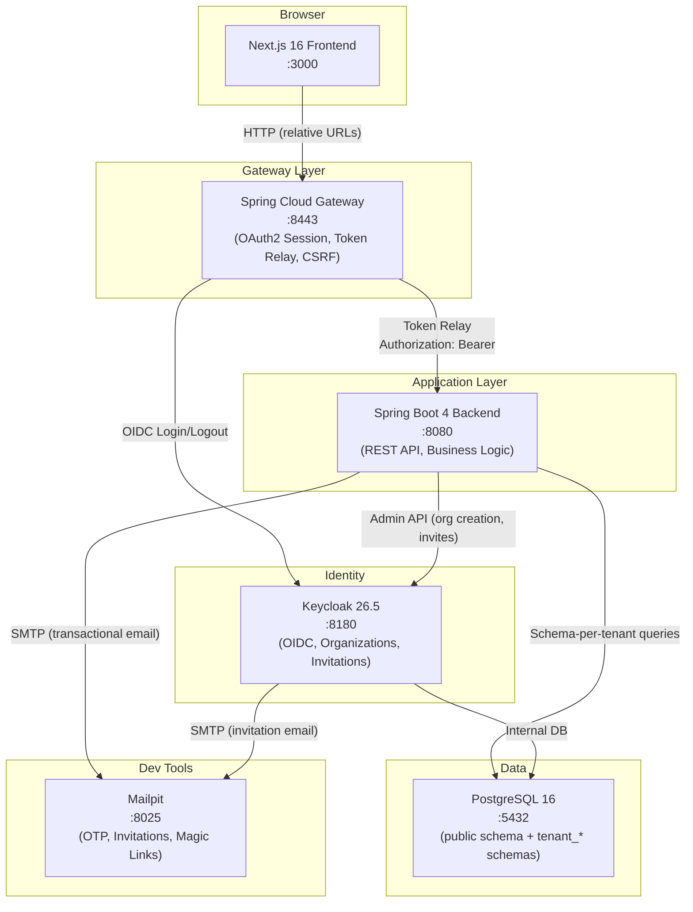
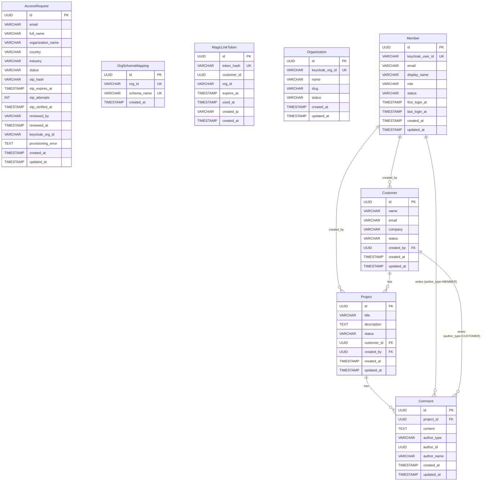

# Architecture & Why Schema-Per-Tenant

Every multitenant SaaS team faces the same fork in the road: how do you keep Tenant A's data
invisible to Tenant B? The answer shapes your query layer, your compliance story, your backup
strategy, and the mental overhead every developer carries on every feature.

This template picks **schema-per-tenant isolation** — one PostgreSQL schema per customer
organization — and builds everything else around that choice. In this post we'll walk through
what's in the box, how the pieces connect, and why we chose schemas over the more common
`WHERE tenant_id = ?` pattern.

---

## What's in the Box

This isn't a hello-world scaffold. It's an opinionated, production-shaped starter that covers
the hard parts most teams defer:

- **Schema-per-tenant isolation** (Hibernate 7 + PostgreSQL 16) — zero `WHERE tenant_id = ?`
- **Keycloak 26.5 organizations** — OIDC, gated invitations, group-based platform admin
- **Spring Cloud Gateway BFF** — session cookies, token relay, CSRF; tokens never reach the browser
- **Java 25 ScopedValues** (JEP 506) — request context propagation, virtual-thread-safe
- **Gated tenant registration** — access request, OTP email, platform admin approval, provisioning
- **Idempotent provisioning pipeline** — safe retries, `OrgSchemaMapping` as commit marker
- **Customer portal with magic links** — password-free portal access, HS256 portal JWTs
- **Dual-author comments** — members (Keycloak) and customers (magic link) in the same table
- **Member invitation + profile sync** — Keycloak invite flow, product-layer roles
- **Meaningful domain model** — Projects, Customers, Comments (not just scaffolding)
- **One-command dev environment** — `bash compose/scripts/dev-up.sh`
- **10-part blog series** — you're reading it now

---

## Tech Stack

| Layer | Technology | Key Choice |
|-------|-----------|------------|
| Language | Java 25 | ScopedValues (JEP 506), Virtual Threads, Records |
| Backend | Spring Boot 4.0.2 | Hibernate 7, Flyway, OAuth2 Resource Server |
| Gateway | Spring Cloud Gateway (WebMVC) | BFF, OAuth2 Client, TokenRelay, Spring Session JDBC |
| Frontend | Next.js 16 (App Router) | React 19, Tailwind CSS v4, Shadcn UI |
| Auth | Keycloak 26.5 | Organizations, invitations, RBAC |
| Database | PostgreSQL 16 | Schema-per-tenant multitenancy |
| Email | Mailpit | Dev email capture (OTP, invites, magic links) |
| Build | Maven + pnpm | Maven parent POM, monorepo |

---

## System Context

Here's how the pieces fit together at the network level:



A few things to notice:

1. **The frontend never talks to the backend directly.** Every API call goes through the Gateway,
   which handles OAuth2 sessions and relays JWTs.
2. **The backend talks to Keycloak for admin operations** (creating organizations, inviting users)
   using a service-account client (`starter-admin-cli`).
3. **Mailpit captures all email in dev** — OTP codes, Keycloak invitations, magic links. Open
   `http://localhost:8025` to inspect them.

---

## The Data Model

The template ships with a meaningful domain model — enough to demonstrate real multitenancy
patterns without drowning you in business logic:



Notice the split: **AccessRequest**, **OrgSchemaMapping**, and **MagicLinkToken** live in the
`public` schema (they're cross-tenant or pre-tenant). Everything else lives in a dedicated
tenant schema.

---

## Public Schema vs. Tenant Schema

Here's what the PostgreSQL instance looks like at runtime:

```
PostgreSQL Instance
├── public schema
│   ├── access_requests
│   ├── org_schema_mappings
│   ├── magic_link_tokens
│   └── flyway_schema_history (public migrations)
├── tenant_a1b2c3d4e5f6 schema
│   ├── organizations
│   ├── members
│   ├── customers
│   ├── projects
│   ├── comments
│   └── flyway_schema_history (tenant migrations)
├── tenant_c3d4e5f6a1b2 schema
│   └── ... (same structure)
└── keycloak schema (Keycloak internal)
```

Schema names are deterministic: `"tenant_" + first 12 hex chars of SHA-256(orgSlug)`. The
algorithm lives in `backend/src/main/java/io/github/rakheendama/starter/multitenancy/SchemaNameGenerator.java`:

```java
public static String generate(String orgSlug) {
    MessageDigest digest = MessageDigest.getInstance("SHA-256");
    byte[] hashBytes = digest.digest(orgSlug.getBytes(StandardCharsets.UTF_8));
    StringBuilder hex = new StringBuilder();
    for (byte b : hashBytes) {
        hex.append(String.format("%02x", b));
    }
    return "tenant_" + hex.substring(0, 12);
}
// "acme-corp" → SHA-256 → take first 12 hex chars → "tenant_a3f2b1c4d5e6"
```

The `OrgSchemaMapping` entity in `backend/src/main/java/io/github/rakheendama/starter/multitenancy/OrgSchemaMapping.java`
acts as the registry — and as the **commit marker** for the provisioning pipeline
(more on that in [Post 05](./05-tenant-registration-pipeline.md)).

---

## Why Schema-Per-Tenant

This is the most consequential architectural decision in the template. Here's the comparison:

| Concern | Row-Level (`tenant_id` column) | Schema-Per-Tenant |
|---------|------------------------------|-------------------|
| Isolation guarantee | Application-enforced (one missed `WHERE` = data leak) | Database-enforced (physically separate) |
| Query complexity | Every query needs `WHERE tenant_id = ?` | Standard queries, no tenant filter |
| Index overhead | Composite indexes on `(tenant_id, ...)` everywhere | Standard single-column indexes |
| Backup/restore | Cannot restore single tenant without surgery | Backup/restore individual schemas |
| Compliance | Must prove row-level filtering is airtight | Physical separation is self-evident |
| Migration complexity | Single migration run | Migration per schema (automated) |
| Scalability ceiling | Single schema with very large tables | Each schema stays small; can shard later |

The full decision rationale is in `adr/ADR-T001-schema-per-tenant-over-row-level-isolation.md`.

**The bottom line:** row-level isolation is simpler to set up but harder to get right. Schema
isolation is harder to set up (you need the multitenancy core we'll build in
[Post 03](./03-the-multitenancy-core.md)) but once it's in place, every feature you build is
just... normal code. No tenant filters, no defensive `WHERE` clauses, no "did I forget the
tenant predicate?" anxiety.

> **Trade-off acknowledged:** DDL migrations run per-schema. With 1,000 tenants and a 30-second
> migration, you're looking at ~8 hours of serial migration time. Flyway handles this, and you
> can parallelize with a migration runner — but it's real operational cost. The template includes
> `TenantMigrationRunner` in `backend/src/main/java/io/github/rakheendama/starter/config/TenantMigrationRunner.java`
> to automate this.

---

## Six Architecture Principles

These principles shaped every decision in the template:

1. **Schema-per-tenant isolation** — no `WHERE tenant_id = ?`
2. **BFF pattern** — the frontend never sees a JWT
3. **ScopedValues over ThreadLocal** — immutable, auto-cleaned, virtual-thread-safe
4. **Virtual threads from day one** — `spring.threads.virtual.enabled=true`
5. **Three auth mechanisms, one application** — OIDC (members), platform admin groups, HS256 portal JWTs
6. **Idempotent everything** — provisioning, migrations, state transitions are all retryable

We'll unpack each of these across the series. The BFF pattern gets its own post
([Post 04](./04-spring-cloud-gateway-as-bff.md)), ScopedValues are the heart of
[Post 03](./03-the-multitenancy-core.md), and the registration pipeline in
[Post 05](./05-tenant-registration-pipeline.md) demonstrates idempotency end-to-end.

---

## What's Next

In [Post 02: One-Command Dev Environment](./02-one-command-dev-environment.md), we'll walk
through the Docker Compose stack, Keycloak realm import, the bootstrap script, and how
`dev-up.sh` gets you from zero to a running system in under two minutes.

---

*This is post 1 of 10 in the **Zero to Prod: Multitenant SaaS with Java 25, Keycloak & Spring Boot 4** series.*
