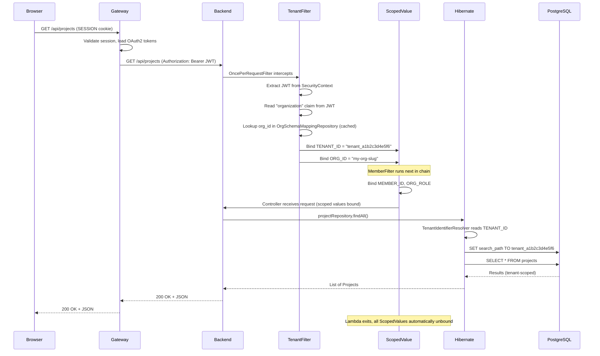

# The Multitenancy Core

This is the post where schema-per-tenant stops being an architecture diagram and becomes
working code. We need to answer one question: **when a request arrives, how does Hibernate
know which schema to query?**

The answer is a pipeline of five components:

1. **TenantFilter** — reads the JWT, looks up the schema name, binds it as a ScopedValue
2. **MemberFilter** — resolves the member identity, binds it as a ScopedValue
3. **TenantIdentifierResolver** — Hibernate asks "which tenant?", we read the ScopedValue
4. **SchemaMultiTenantConnectionProvider** — executes `SET search_path TO <schema>` on each connection
5. **HibernateMultiTenancyConfig** — wires the above into Spring Boot 4's Hibernate autoconfiguration

Let's walk through each one.

---

## RequestScopes — The Context Holder

Before we look at the filters, let's see where the context lives. Every piece of request-scoped
state is a `ScopedValue` on this class
(`backend/src/main/java/io/github/rakheendama/starter/multitenancy/RequestScopes.java`):

```java
public final class RequestScopes {

  /** Tenant schema name (e.g., "tenant_a1b2c3d4e5f6"). Bound by TenantFilter. */
  public static final ScopedValue<String> TENANT_ID = ScopedValue.newInstance();

  /** Keycloak org alias (from JWT "organization" claim). Bound by TenantFilter. */
  public static final ScopedValue<String> ORG_ID = ScopedValue.newInstance();

  /** Current member's UUID within the tenant. Bound by MemberFilter. */
  public static final ScopedValue<UUID> MEMBER_ID = ScopedValue.newInstance();

  /** Current member's org role ("owner" or "member"). Bound by MemberFilter. */
  public static final ScopedValue<String> ORG_ROLE = ScopedValue.newInstance();

  /** Authenticated customer's UUID. Bound by PortalAuthFilter for portal requests. */
  public static final ScopedValue<UUID> CUSTOMER_ID = ScopedValue.newInstance();

  /** JWT group memberships (e.g., "platform-admins"). Bound by platform admin filter. */
  public static final ScopedValue<Set<String>> GROUPS = ScopedValue.newInstance();

  public static final String DEFAULT_TENANT = "public";

  /** Returns the current member's UUID. Throws if not bound by filter chain. */
  public static UUID requireMemberId() {
    if (!MEMBER_ID.isBound()) {
      throw new IllegalStateException("Member context not available — MEMBER_ID not bound");
    }
    return MEMBER_ID.get();
  }

  /** Returns true if the current request has the platform-admins group. */
  public static boolean isPlatformAdmin() {
    return getGroups().contains("platform-admins");
  }

  private RequestScopes() {}
}
```

No constructors. No state. Just `ScopedValue` fields. Each is bound by a specific filter and
read by whatever needs it downstream — controllers, services, Hibernate itself.

> **Why ScopedValues and not ThreadLocal?** We'll cover this in detail at the end of this post.
> The short version: ScopedValues are immutable within their scope, automatically cleaned up when
> the binding lambda exits, and have zero per-virtual-thread overhead. ThreadLocal has none of
> these properties.

---

## ScopedFilterChain — Bridging the Exception Gap

There's a practical problem: `ScopedValue.where().run()` takes a `Runnable`, but servlet
filters throw `IOException` and `ServletException`. We need a bridge.

`backend/src/main/java/io/github/rakheendama/starter/multitenancy/ScopedFilterChain.java`:

```java
public final class ScopedFilterChain {

  private ScopedFilterChain() {}

  public static void runScoped(
      ScopedValue.Carrier carrier,
      FilterChain chain,
      HttpServletRequest request,
      HttpServletResponse response)
      throws ServletException, IOException {
    try {
      carrier.run(
          () -> {
            try {
              chain.doFilter(request, response);
            } catch (IOException e) {
              throw new WrappedIOException(e);
            } catch (ServletException e) {
              throw new WrappedServletException(e);
            }
          });
    } catch (WrappedIOException e) {
      throw e.wrapped;
    } catch (WrappedServletException e) {
      throw e.wrapped;
    }
  }

  static final class WrappedIOException extends RuntimeException {
    final IOException wrapped;
    WrappedIOException(IOException e) { super(e); this.wrapped = e; }
  }

  static final class WrappedServletException extends RuntimeException {
    final ServletException wrapped;
    WrappedServletException(ServletException e) { super(e); this.wrapped = e; }
  }
}
```

The pattern: wrap checked exceptions in unchecked wrappers inside the lambda, catch and unwrap
outside. Not elegant, but correct — and it's the only place in the codebase that deals with
this mismatch.

---

## TenantFilter — From JWT to Schema

The core filter. For every authenticated request, it extracts the organization claim from the
JWT, resolves the corresponding schema name, and binds it as a ScopedValue.

`backend/src/main/java/io/github/rakheendama/starter/multitenancy/TenantFilter.java`:

```java
@Component
public class TenantFilter extends OncePerRequestFilter {

  private final OrgSchemaMappingRepository mappingRepository;
  private final Cache<String, String> orgSchemaCache =
      Caffeine.newBuilder().maximumSize(10_000).expireAfterWrite(Duration.ofMinutes(5)).build();

  public TenantFilter(OrgSchemaMappingRepository mappingRepository) {
    this.mappingRepository = mappingRepository;
  }

  @Override
  protected void doFilterInternal(
      HttpServletRequest request, HttpServletResponse response, FilterChain filterChain)
      throws ServletException, IOException {
    Authentication authentication = SecurityContextHolder.getContext().getAuthentication();

    if (!(authentication instanceof JwtAuthenticationToken jwtAuth)) {
      filterChain.doFilter(request, response);
      return;
    }

    Jwt jwt = jwtAuth.getToken();
    String orgAlias = JwtUtils.extractOrgId(jwt);

    if (orgAlias == null) {
      filterChain.doFilter(request, response);
      return;
    }

    String schema = resolveSchema(orgAlias);
    if (schema == null) {
      response.sendError(HttpServletResponse.SC_FORBIDDEN, "Organization not provisioned");
      return;
    }

    ScopedFilterChain.runScoped(
        ScopedValue.where(RequestScopes.TENANT_ID, schema).where(RequestScopes.ORG_ID, orgAlias),
        filterChain, request, response);
  }

  @Override
  protected boolean shouldNotFilter(HttpServletRequest request) {
    String path = request.getRequestURI();
    return path.startsWith("/actuator/")
        || path.startsWith("/api/access-requests")
        || path.startsWith("/api/platform-admin/")
        || path.startsWith("/api/portal/auth/");
  }

  private String resolveSchema(String orgAlias) {
    String cached = orgSchemaCache.getIfPresent(orgAlias);
    if (cached != null) return cached;
    String schema = mappingRepository.findByOrgId(orgAlias)
        .map(OrgSchemaMapping::getSchemaName).orElse(null);
    if (schema != null) orgSchemaCache.put(orgAlias, schema);
    return schema;
  }
}
```

Key design decisions:

- **Caffeine cache** with a 5-minute TTL. The `OrgSchemaMapping` table is tiny and rarely
  changes — no reason to hit the database on every request.
- **`shouldNotFilter` exclusions** — actuator, access request (pre-tenant), platform admin
  (cross-tenant), and portal auth endpoints skip tenant resolution entirely.
- **`ScopedValue.where().where()`** — the `Carrier` is composable. Both `TENANT_ID` and `ORG_ID`
  are bound atomically within the same scope.
- **Automatic unbinding** — when `ScopedFilterChain.runScoped()` returns, both values are gone.
  No cleanup code. No `finally` block. No risk of stale context leaking to the next request.

---

## SchemaMultiTenantConnectionProvider — SET search_path

Once Hibernate knows which tenant to use (via `TenantIdentifierResolver`), it needs a connection
pointing at the right schema. That's what this provider does.

From `backend/src/main/java/io/github/rakheendama/starter/multitenancy/SchemaMultiTenantConnectionProvider.java`:

```java
@Override
public Connection getConnection(String tenantIdentifier) throws SQLException {
    Connection connection = getAnyConnection();
    try {
        setSearchPath(connection, tenantIdentifier);
    } catch (SQLException e) {
        releaseAnyConnection(connection);
        throw e;
    }
    return connection;
}

Notice the try-catch: if `SET search_path` fails, we release the connection back to the pool
instead of leaking it.

@Override
public void releaseConnection(String tenantIdentifier, Connection connection) throws SQLException {
    resetSearchPath(connection);
    releaseAnyConnection(connection);
}

private void setSearchPath(Connection connection, String schema) throws SQLException {
    try (var stmt = connection.createStatement()) {
        stmt.execute("SET search_path TO " + sanitizeSchema(schema));
    }
}

private String sanitizeSchema(String schema) {
    if ("public".equals(schema) || SCHEMA_PATTERN.matcher(schema).matches()) {
        return schema;
    }
    throw new IllegalArgumentException("Invalid schema name: " + schema);
}
// SCHEMA_PATTERN = "^tenant_[0-9a-f]{12}$"
```

The `sanitizeSchema` method is the SQL injection guard. Schema names must either be `"public"`
or match the deterministic `tenant_<12 hex chars>` pattern. Anything else throws immediately.

> **Connection lifecycle:** `getConnection` borrows from the pool, sets the search path.
> `releaseConnection` resets the search path to `public` and returns the connection. The
> connection pool never holds connections with a stale search path.

---

## TenantIdentifierResolver — Hibernate's Hook

Hibernate calls this to determine the current tenant. It reads the ScopedValue bound by
TenantFilter.

`backend/src/main/java/io/github/rakheendama/starter/multitenancy/TenantIdentifierResolver.java`:

```java
@Component
public class TenantIdentifierResolver implements CurrentTenantIdentifierResolver<String> {

  @Override
  public String resolveCurrentTenantIdentifier() {
    return RequestScopes.TENANT_ID.isBound()
        ? RequestScopes.TENANT_ID.get()
        : RequestScopes.DEFAULT_TENANT;
  }

  @Override
  public boolean validateExistingCurrentSessions() {
    return true;
  }

  @Override
  public boolean isRoot(String tenantId) {
    return RequestScopes.DEFAULT_TENANT.equals(tenantId);
  }
}
```

When `TENANT_ID` is not bound (e.g., during application startup, migration runs, or public
endpoint access), the resolver falls back to `"public"`. The `isRoot` method tells Hibernate
that `"public"` is the default schema.

---

## HibernateMultiTenancyConfig — Wiring It Together

`backend/src/main/java/io/github/rakheendama/starter/config/HibernateMultiTenancyConfig.java`:

```java
@Configuration
public class HibernateMultiTenancyConfig {

  @Bean
  HibernatePropertiesCustomizer multiTenancyCustomizer(
      SchemaMultiTenantConnectionProvider connectionProvider,
      TenantIdentifierResolver tenantResolver) {
    return (Map<String, Object> hibernateProperties) -> {
      hibernateProperties.put(
          MultiTenancySettings.MULTI_TENANT_CONNECTION_PROVIDER, connectionProvider);
      hibernateProperties.put(
          MultiTenancySettings.MULTI_TENANT_IDENTIFIER_RESOLVER, tenantResolver);
    };
  }
}
```

Three gotchas worth noting for anyone working with Hibernate 7 and Spring Boot 4:

1. **No `hibernate.multiTenancy` property.** Hibernate 7 auto-detects multitenancy from the
   registered `MultiTenantConnectionProvider`. Setting the property explicitly can cause conflicts.
2. **Use `MultiTenancySettings` constants**, not string keys. The string keys changed between
   Hibernate 6 and 7.
3. **`HibernatePropertiesCustomizer`** lives in `org.springframework.boot.hibernate.autoconfigure`
   in Boot 4 (it was in `boot.orm.jpa` in Boot 3).

---

## The Full Request Lifecycle

Here's what happens when the frontend fetches a list of projects:



The controller that handles this request has no idea multitenancy exists:

```java
@GetMapping
public ResponseEntity<List<ProjectResponse>> list() {
    return ResponseEntity.ok(projectService.findAll());
}
```

No tenant parameter. No filter. Just `findAll()`. The multitenancy core handles the rest.

---

## OrgSchemaMapping — The Registry

The `OrgSchemaMapping` entity in
`backend/src/main/java/io/github/rakheendama/starter/multitenancy/OrgSchemaMapping.java`
maps an org slug to its schema name. It lives in the `public` schema because it needs to be
accessible before any tenant context is established.

It also serves as the **commit marker** for the provisioning pipeline — if the mapping exists,
the tenant is fully provisioned. See [Post 05](./05-tenant-registration-pipeline.md) for details.

---

## Why ScopedValues Over ThreadLocal

The full reasoning is in `adr/ADR-T002-scopedvalues-over-threadlocal.md`. Here's the comparison:

| Property | ThreadLocal | ScopedValue (Java 25) |
|----------|-------------|----------------------|
| Mutability | Mutable from anywhere | Immutable within scope |
| Cleanup | Manual `remove()` required | Automatic on lambda exit |
| Virtual thread overhead | Per-thread storage allocation | Zero per-thread overhead |
| Scope boundary | Implicit (no clear start/end) | Explicit (binding lambda) |
| Memory leak risk | High (forgotten cleanup) | None |

With virtual threads enabled (`spring.threads.virtual.enabled=true`), every request runs on
its own virtual thread. ThreadLocal allocates storage per virtual thread — that's potentially
millions of allocations under load. ScopedValues have zero per-thread overhead because they
use structured scoping rather than per-thread storage.

The practical benefit: you can never forget to clean up. There's no `finally` block with
`threadLocal.remove()`. When the `ScopedValue.where().run()` lambda exits, the value is gone.
Period.

---

## What's Next

The multitenancy core routes requests to the right schema, but how does the request get here
in the first place? In [Post 04: Spring Cloud Gateway as BFF](./04-spring-cloud-gateway-as-bff.md),
we'll look at how the Gateway handles OAuth2 sessions, relays tokens to the backend, manages
CSRF, and why the frontend never sees a JWT.

---

*This is post 3 of 10 in the **Zero to Prod: Multitenant SaaS with Java 25, Keycloak & Spring Boot 4** series.*
