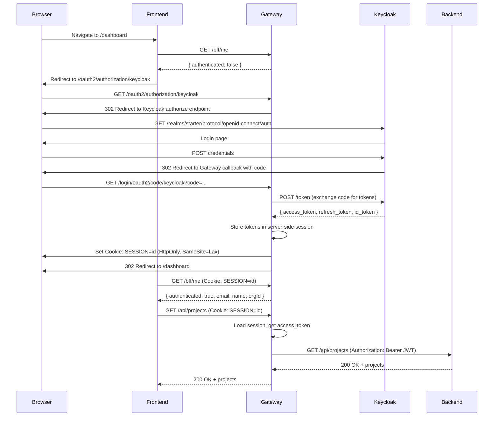

# Spring Cloud Gateway as BFF

Most SPA tutorials show the frontend handling OAuth2 directly — PKCE flow, silent refresh,
token storage in memory or localStorage. It works, but it means every XSS vulnerability
becomes a token theft vulnerability. One injected script and your access token is gone.

This template takes a different approach: the **Backend-for-Frontend (BFF) pattern**. The
Gateway owns the OAuth2 session. The frontend never sees a JWT. Let's look at how it works.

---

## Why Not SPA + PKCE?

The arguments against direct SPA authentication boil down to one thing: **attack surface**.

- **XSS + token theft.** If an attacker injects JavaScript, they can read any in-memory token
  and exfiltrate it. With the BFF pattern, there's no token to steal — the browser only has
  an opaque session cookie (`HttpOnly`, `SameSite=Lax`).
- **Token refresh complexity.** Silent refresh via hidden iframes is fragile, especially with
  third-party cookie restrictions. The Gateway refreshes tokens server-side, transparently.
- **Auth library coupling.** SPA auth libraries (e.g., `oidc-client-ts`) add complexity and
  a maintenance burden. With BFF, the frontend uses `fetch('/api/...')` with cookies. No auth
  library needed.

The full decision rationale is in `adr/ADR-T004-gateway-bff-over-direct-api-access.md`.

---

## The OAuth2 Login Flow

Here's the complete sequence from "user visits the app" to "first API call succeeds":



The key insight: **tokens never leave the server.** The browser sends a session cookie. The
Gateway translates that cookie into a Bearer token for the backend. The backend validates
the JWT (RS256, Keycloak JWKS) and has no idea a Gateway is involved.

---

## GatewaySecurityConfig

The security configuration lives in
`gateway/src/main/java/io/github/rakheendama/starter/gateway/config/GatewaySecurityConfig.java`:

```java
@Configuration
@EnableWebSecurity
public class GatewaySecurityConfig {

  @Bean
  public SecurityFilterChain securityFilterChain(HttpSecurity http) throws Exception {
    http.cors(cors -> cors.configurationSource(corsConfigurationSource()))
        .authorizeHttpRequests(
            auth ->
                auth.requestMatchers("/", "/error", "/actuator/health", "/bff/me", "/bff/csrf")
                    .permitAll()
                    .requestMatchers("/api/access-requests", "/api/access-requests/verify")
                    .permitAll()
                    .requestMatchers("/api/portal/**")
                    .permitAll()
                    .requestMatchers("/internal/**")
                    .denyAll()
                    .requestMatchers("/api/**")
                    .authenticated()
                    .anyRequest()
                    .authenticated())
        .oauth2Login(oauth2 -> oauth2.defaultSuccessUrl(frontendUrl + "/dashboard", true))
        .logout(
            logout ->
                logout
                    .logoutUrl("/bff/logout")
                    .logoutSuccessHandler(oidcLogoutSuccessHandler())
                    .invalidateHttpSession(true)
                    .deleteCookies("SESSION"))
        .csrf(
            csrf ->
                csrf.csrfTokenRepository(csrfTokenRepository())
                    .csrfTokenRequestHandler(new SpaCsrfTokenRequestHandler())
                    .ignoringRequestMatchers("/bff/csrf"))
        .exceptionHandling(
            ex ->
                ex.defaultAuthenticationEntryPointFor(
                    new HttpStatusEntryPoint(HttpStatus.UNAUTHORIZED),
                    PathPatternRequestMatcher.pathPattern("/api/**")))
        .sessionManagement(
            session ->
                session
                    .sessionCreationPolicy(SessionCreationPolicy.IF_REQUIRED)
                    .sessionFixation(sessionFixation -> sessionFixation.changeSessionId()));
    return http.build();
  }
}
```

Let's break down the important sections:

**Authorization rules:**
- `/bff/me`, `/bff/csrf`, health check — public (the frontend calls these before authentication)
- `/api/access-requests` — public (pre-tenant registration flow)
- `/api/portal/**` — public (portal uses its own HS256 JWT auth, not session-based)
- `/internal/**` — denied (backend-only internal endpoints must never be exposed through the Gateway)
- Everything else under `/api/**` — requires authentication

**OAuth2 login:**
- After successful login, redirect to the frontend's `/dashboard` page
- Spring Security handles the entire authorization code exchange

**Logout:**
- `POST /bff/logout` triggers OIDC-compliant logout (Keycloak RP-initiated logout)
- Session invalidated, `SESSION` cookie deleted

**CSRF:**
- Cookie-based CSRF token repository (`XSRF-TOKEN` cookie)
- Custom `SpaCsrfTokenRequestHandler` for SPA compatibility
- `/bff/csrf` excluded from CSRF checks (it's the endpoint that bootstraps the token)

**Exception handling:**
- API requests from unauthenticated users get `401 Unauthorized` (not a redirect to Keycloak's
  login page). The frontend decides when to redirect.

**Session management:**
- `IF_REQUIRED` — sessions created only when needed (on login)
- `changeSessionId()` on login — prevents session fixation attacks

---

## Route Configuration and TokenRelay

The route config in `gateway/src/main/resources/application.yml` is where the BFF magic happens:

```yaml
spring:
  cloud:
    gateway:
      server:
        webmvc:
          routes:
            - id: backend-api
              uri: ${BACKEND_URL:http://localhost:8080}
              predicates:
                - Path=/api/**
              filters:
                - TokenRelay=
                - DedupeResponseHeader=Access-Control-Allow-Origin Access-Control-Allow-Credentials, RETAIN_FIRST
```

The `TokenRelay=` filter is the entire relay mechanism. It:

1. Reads the stored OAuth2 access token from the server-side session
2. Adds `Authorization: Bearer <access_token>` header to the proxied request
3. Refreshes the token automatically if it has expired

The backend receives a standard JWT. It validates using Keycloak's JWKS endpoint. It has
no idea a Gateway or session is involved.

---

## Spring Session JDBC

Sessions are stored in PostgreSQL, not in memory:

```yaml
spring:
  session:
    store-type: jdbc
    jdbc:
      initialize-schema: always
      table-name: SPRING_SESSION
    timeout: 8h
```

This means Gateway restarts don't lose sessions. It also means you can scale the Gateway
horizontally — any instance can serve any session, because the session store is shared.

The session cookie configuration:

```yaml
server:
  servlet:
    session:
      cookie:
        http-only: true
        secure: true
        same-site: lax
        name: SESSION
```

- **`http-only: true`** — JavaScript cannot read the cookie (XSS defense)
- **`secure: true`** — cookie only sent over HTTPS (in production)
- **`same-site: lax`** — cookie sent on top-level navigations but not cross-origin POST
  (CSRF defense layer)

---

## BffController — The Frontend's View of Auth

The frontend interacts with auth through two endpoints on `BffController`
(`gateway/src/main/java/io/github/rakheendama/starter/gateway/BffController.java`):

```java
@GetMapping("/me")
public ResponseEntity<BffUserInfo> me(@AuthenticationPrincipal OidcUser user) {
    if (user == null) {
        return ResponseEntity.ok(BffUserInfo.unauthenticated());
    }
    BffUserInfoExtractor.OrgInfo orgInfo = BffUserInfoExtractor.extractOrgInfo(user);
    List<String> groups = extractGroups(user);
    return ResponseEntity.ok(new BffUserInfo(
        true, user.getSubject(), user.getEmail(), user.getFullName(),
        Objects.toString(user.getPicture(), ""),
        orgInfo != null ? orgInfo.id() : null,
        orgInfo != null ? orgInfo.slug() : null,
        groups));
}
```

`GET /bff/me` returns the current user's identity — or `{ authenticated: false }` if no
session exists. The frontend calls this on every page load to determine whether to show
the app or redirect to login.

```java
@GetMapping("/csrf")
public ResponseEntity<Map<String, String>> csrf(HttpServletRequest request) {
    CsrfToken csrfToken = (CsrfToken) request.getAttribute(CsrfToken.class.getName());
    return ResponseEntity.ok(Map.of(
        "token", csrfToken.getToken(),
        "parameterName", csrfToken.getParameterName(),
        "headerName", csrfToken.getHeaderName()));
}
```

`GET /bff/csrf` bootstraps the CSRF token. The frontend calls this before its first mutating
request (POST/PUT/DELETE/PATCH), reads the returned `headerName` and `token`, and sends them
as a header on subsequent requests.

---

## Keycloak Organization Claim

Keycloak 26.x emits the `organization` claim in two possible formats. The
`BffUserInfoExtractor` in
`gateway/src/main/java/io/github/rakheendama/starter/gateway/config/BffUserInfoExtractor.java`
handles both:

```java
public static OrgInfo extractOrgInfo(OidcUser user) {
    Object raw = user.getClaim("organization");

    if (raw instanceof List<?> list) {
        // Built-in format: ["acme-corp"] — alias only
        String alias = (String) list.getFirst();
        return new OrgInfo(alias, alias);
    }

    if (raw instanceof Map<?, ?>) {
        // Rich format: {"acme-corp": {"id": "uuid", "roles": [...]}}
        Map<String, Object> orgClaim = (Map<String, Object>) raw;
        var entry = orgClaim.entrySet().iterator().next();
        String slug = entry.getKey();
        Map<String, Object> orgData = (Map<String, Object>) entry.getValue();
        String id = (String) orgData.getOrDefault("id", slug);
        return new OrgInfo(slug, id);
    }
    return null;
}
```

The **list format** is what you get from Keycloak's built-in `organization` scope. The
**map format** comes from a custom protocol mapper. The template's realm export configures
the built-in scope, but the extractor handles both for forward compatibility.

---

## CSRF Flow

The CSRF protection uses Spring Security's cookie-based pattern with a SPA twist:

1. Frontend calls `GET /bff/csrf` before its first mutation
2. Gateway sets the `XSRF-TOKEN` cookie (readable by JavaScript — `withHttpOnlyFalse()`)
3. Frontend reads the cookie value, sends `X-XSRF-TOKEN` header on mutating requests
4. `SpaCsrfTokenRequestHandler`
   (`gateway/src/main/java/io/github/rakheendama/starter/gateway/config/SpaCsrfTokenRequestHandler.java`)
   uses XOR-based BREACH mitigation for the token value
5. `CookieCsrfTokenRepository` validates the header matches the stored token

Combined with `SameSite=Lax` on the session cookie, this provides defense in depth: even if
an attacker finds a way to send a cross-origin request with the session cookie, they can't
forge the CSRF header.

---

## What the Frontend Does

From the frontend's perspective, auth is invisible:

```typescript
// Check auth status
const res = await fetch('/bff/me');
const user = await res.json();
if (!user.authenticated) {
  window.location.href = '/oauth2/authorization/keycloak';
}

// API calls — just use relative URLs, cookies travel automatically
const projects = await fetch('/api/projects');
```

No auth library. No token management. No silent refresh. The Gateway handles all of it.

---

## What's Next

We have the BFF pattern securing the frontend and the multitenancy core routing requests to
the right schema. But how do tenants get created in the first place? In
[Post 05: Tenant Registration Pipeline](./05-tenant-registration-pipeline.md), we'll walk
through the access request state machine, OTP verification, platform admin approval, and the
idempotent provisioning pipeline that creates Keycloak organizations and PostgreSQL schemas.

---

*This is post 4 of 10 in the **Zero to Prod: Multitenant SaaS with Java 25, Keycloak & Spring Boot 4** series.*
