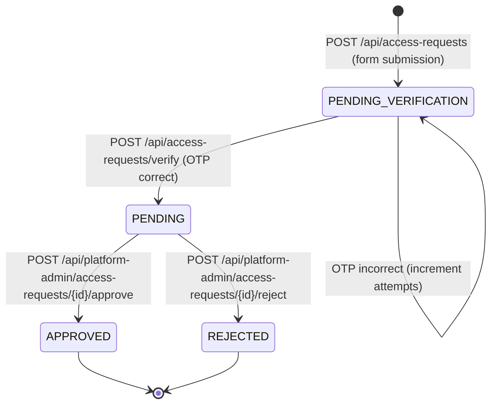
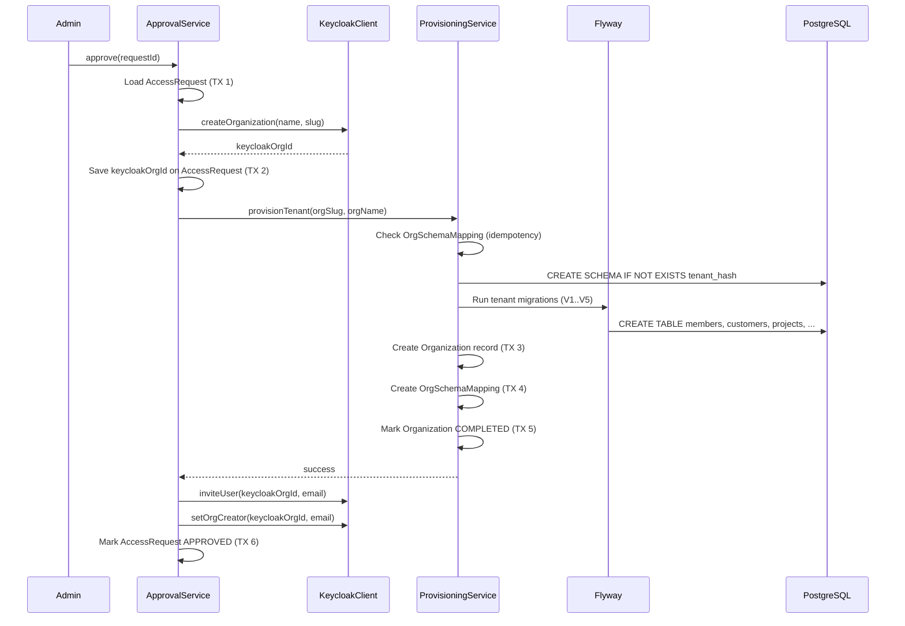

# Tenant Registration Pipeline

Most multitenant SaaS tutorials skip tenant creation entirely. "Just create a schema," they say.
But in production you need to answer harder questions: Who's allowed to create a tenant? What
happens if provisioning fails halfway? How do you retry without creating duplicates?

This template implements **gated registration** — an access request flow with OTP email
verification, platform admin approval, and an idempotent provisioning pipeline that's safe to
retry at any point.

---

## Why Gated Registration?

Self-service signup is great for consumer SaaS. For B2B, it's often a liability:

- **Resource cost.** Each tenant gets a PostgreSQL schema, a Keycloak organization, and
  Flyway migrations. Spam signups waste real resources.
- **Quality control.** You want to review who's using your platform before provisioning
  infrastructure.
- **Compliance.** Some industries require knowing your customers before granting access.

The template's approach: visitors submit a request, verify their email via OTP, and wait for
a platform admin to approve. Only then does provisioning happen.

---

## The Access Request State Machine



Four states, three happy-path transitions:

1. **PENDING_VERIFICATION** — form submitted, OTP emailed, waiting for verification
2. **PENDING** — email verified, waiting for platform admin review
3. **APPROVED** — admin approved, provisioning complete
4. **REJECTED** — admin rejected, no provisioning

The full flow in plain English:

```
Visitor fills form → OTP email → Visitor verifies OTP → Request enters PENDING queue
→ Platform admin reviews → Approve → Provision Keycloak org + tenant schema + invite
→ Invitee receives email → Registers with Keycloak → First login → Member sync creates owner record
```

---

## Step 1: Form Submission

The visitor submits their name, email, organization name, country, and industry. The
`AccessRequestService` creates an entity in the `public` schema and generates an OTP:

The `AccessRequest` entity (`backend/src/main/java/io/github/rakheendama/starter/accessrequest/AccessRequest.java`)
stores the request state and OTP metadata:

```java
@Entity
@Table(name = "access_requests", schema = "public")
public class AccessRequest {

  @Id @GeneratedValue(strategy = GenerationType.UUID)
  private UUID id;

  @Column(name = "status", nullable = false, length = 20)
  private String status;  // PENDING_VERIFICATION → PENDING → APPROVED/REJECTED

  @Column(name = "otp_hash")
  private String otpHash;  // BCrypt hash — raw OTP NEVER stored

  @Column(name = "otp_expires_at")
  private Instant otpExpiresAt;

  @Column(name = "otp_attempts", nullable = false)
  private int otpAttempts;  // brute-force protection counter

  @Column(name = "keycloak_org_id")
  private String keycloakOrgId;  // set during provisioning

  @Column(name = "provisioning_error", columnDefinition = "TEXT")
  private String provisioningError;  // captures failure details for retry

  @Version
  @Column(name = "version", nullable = false)
  private Long version;  // optimistic locking across concurrent approval attempts
}
```

Notice: `otpHash` stores a **BCrypt hash**, never the raw OTP. The `provisioningError` field
captures failure details so an admin can diagnose and retry. The `@Version` field prevents
concurrent approval of the same request.

---

## Step 2: OTP Generation and Security

The `OtpService` (`backend/src/main/java/io/github/rakheendama/starter/accessrequest/OtpService.java`)
handles OTP generation and verification:

```java
@Service
public class OtpService {

  public String generateOtp() {
    return String.format("%06d", secureRandom.nextInt(1_000_000));
  }

  public String hashOtp(String otp) {
    return passwordEncoder.encode(otp);  // BCrypt, work factor 12
  }

  public boolean verifyOtp(String rawOtp, String hash) {
    return passwordEncoder.matches(rawOtp, hash);
  }

  public Instant otpExpiresAt(int expiryMinutes) {
    return Instant.now().plus(expiryMinutes, ChronoUnit.MINUTES);
  }
}
```

Security properties of the OTP system:

- **Generation:** `SecureRandom.getInstanceStrong()` — OS-level entropy, not `Math.random()`
- **Format:** 6-digit numeric (1,000,000 possible values)
- **Storage:** BCrypt hash (work factor 12) — the raw OTP is never persisted
- **TTL:** Configurable, default 10 minutes
- **Attempt limit:** Configurable, default 5 attempts
- **Anti-enumeration:** Identical error messages whether the email exists or not

---

## Step 3: OTP Verification

The verification logic in `AccessRequestService`
(`backend/src/main/java/io/github/rakheendama/starter/accessrequest/AccessRequestService.java`)
is carefully ordered to prevent timing attacks:

```java
@Transactional(noRollbackFor = {InvalidStateException.class})
public VerifyOtpResponse verifyOtp(String email, String otp) {
    var entity = accessRequestRepository
        .findByEmailAndStatus(normalizedEmail, "PENDING_VERIFICATION")
        .orElseThrow(() -> new InvalidStateException("Verification failed", "Verification failed"));

    if (now.isAfter(entity.getOtpExpiresAt())) {
        throw new InvalidStateException("OTP expired", "Please submit a new access request");
    }

    if (entity.getOtpAttempts() >= otpMaxAttempts) {
        throw new InvalidStateException("Too many attempts", "Maximum verification attempts exceeded");
    }

    // Increment BEFORE verifying — prevents timing attack on BCrypt check
    entity.setOtpAttempts(entity.getOtpAttempts() + 1);
    accessRequestRepository.save(entity);

    if (!otpService.verifyOtp(otp, entity.getOtpHash())) {
        throw new InvalidStateException("Invalid OTP", "The verification code is incorrect");
    }

    entity.setStatus("PENDING");
    entity.setOtpVerifiedAt(now);
    entity.setOtpHash(null);  // hash cleared — not needed again
    accessRequestRepository.save(entity);
    return new VerifyOtpResponse("Email verified. Your request is pending review.");
}
```

Three details worth calling out:

1. **Counter incremented before BCrypt check.** A timing attack could distinguish "wrong OTP
   (fast reject at counter check)" from "wrong OTP (slow BCrypt comparison)". Incrementing
   first makes both paths hit BCrypt.
2. **`noRollbackFor = {InvalidStateException.class}`** — failed verification attempts still
   persist the incremented counter. Without this, Spring would roll back the counter increment
   on exception.
3. **OTP hash cleared on success** — the hash serves no purpose after verification. Clearing
   it reduces the data exposure window.

---

## Step 4: Platform Admin Approval Queue

Once verified, the request enters the PENDING queue. Platform admins (members of the
`platform-admins` group in Keycloak) review requests via the
`PlatformAdminController` (`backend/src/main/java/io/github/rakheendama/starter/accessrequest/PlatformAdminController.java`).

The admin sees the full context: organization name, requester's email, country, industry.
They can approve or reject. On approval, the provisioning pipeline kicks in.

---

## Step 5: The Provisioning Pipeline

This is where the hard work happens. The `AccessRequestApprovalService`
(`backend/src/main/java/io/github/rakheendama/starter/accessrequest/AccessRequestApprovalService.java`)
orchestrates a multi-step provisioning process:

```java
public AccessRequest approve(UUID requestId, String adminEmail) {

    var request = txTemplate.execute(tx -> findPendingRequest(requestId));

    String orgName = request.getOrganizationName();
    String slug = slugify(orgName);
    String email = request.getEmail();

    try {
        // Step 1: Create Keycloak org (persist kcOrgId immediately)
        String kcOrgId = request.getKeycloakOrgId();
        if (kcOrgId == null) {
            kcOrgId = keycloakProvisioningClient.createOrganization(orgName, slug);
            final String orgId = kcOrgId;
            txTemplate.executeWithoutResult(tx -> {
                var fresh = accessRequestRepository.findById(requestId).orElseThrow();
                fresh.setKeycloakOrgId(orgId);
                accessRequestRepository.save(fresh);
            });
        }

        // Step 2: Provision tenant schema
        tenantProvisioningService.provisionTenant(slug, orgName, kcOrgId);

        // Step 3: Invite user + set org creator
        keycloakProvisioningClient.inviteUser(kcOrgId, email);
        keycloakProvisioningClient.setOrgCreator(kcOrgId, email);

        // Step 4: Mark approved
        return txTemplate.execute(tx -> {
            var fresh = accessRequestRepository.findById(requestId).orElseThrow();
            fresh.setStatus("APPROVED");
            fresh.setReviewedBy(adminEmail);
            fresh.setReviewedAt(Instant.now());
            fresh.setProvisioningError(null);
            return accessRequestRepository.save(fresh);
        });
    } catch (Exception e) {
        txTemplate.executeWithoutResult(tx -> {
            var fresh = accessRequestRepository.findById(requestId).orElseThrow();
            fresh.setProvisioningError(e.getMessage());
            accessRequestRepository.save(fresh);
        });
        throw e;
    }
}
```

Each step saves progress immediately. If Step 2 fails, `keycloakOrgId` is already persisted —
a retry skips Step 1. If Step 3 fails, the schema is already provisioned — a retry skips
Steps 1 and 2.

---

## Inside TenantProvisioningService

The schema provisioning itself is a multi-step process
(`backend/src/main/java/io/github/rakheendama/starter/provisioning/TenantProvisioningService.java`):

```java
public ProvisioningResult provisionTenant(String orgSlug, String orgName, String keycloakOrgId) {
    // Idempotency check — if mapping exists, tenant is fully provisioned
    var existingMapping = mappingRepository.findByOrgId(orgSlug);
    if (existingMapping.isPresent()) {
        return ProvisioningResult.alreadyProvisioned(existingMapping.get().getSchemaName());
    }

    String schemaName = SchemaNameGenerator.generate(orgSlug);

    // Create schema (idempotent)
    new JdbcTemplate(dataSource).execute("CREATE SCHEMA IF NOT EXISTS \"" + schemaName + "\"");

    // Run Flyway tenant migrations
    Flyway.configure()
        .dataSource(dataSource)
        .locations("classpath:db/migration/tenant")
        .schemas(schemaName)
        .baselineOnMigrate(true)
        .load()
        .migrate();

    // Create Organization record (uses ScopedValue to route to tenant schema)
    Organization org = findOrCreateOrganization(schemaName, keycloakOrgId, orgName, orgSlug);

    // Create OrgSchemaMapping (commit marker)
    if (mappingRepository.findByOrgId(orgSlug).isEmpty()) {
        txTemplate.executeWithoutResult(
            tx -> mappingRepository.save(new OrgSchemaMapping(orgSlug, schemaName)));
    }

    markOrganizationCompleted(schemaName, org);
    return ProvisioningResult.success(schemaName);
}
```

The `findOrCreateOrganization` method is noteworthy — it uses `ScopedValue.where()` to
temporarily route Hibernate to the new tenant schema:

```java
private Organization findOrCreateOrganization(...) {
    return ScopedValue.where(RequestScopes.TENANT_ID, schemaName)
        .call(() -> txTemplate.execute(tx ->
            organizationRepository.findByKeycloakOrgId(keycloakOrgId)
                .orElseGet(() -> organizationRepository.save(new Organization(...)))));
}
```

This is the multitenancy core from [Post 03](./03-the-multitenancy-core.md) in action:
binding `TENANT_ID` routes all JPA queries to the target schema, even during provisioning.

---

## The Approval Pipeline Sequence

Here's the full provisioning sequence with transaction boundaries:



Notice the six separate transactions. This is intentional.

> **Why no single wrapping transaction?** Flyway migrations (inside `provisionTenant`) need
> their own database connections with the tenant schema on the `search_path`. An outer
> transaction would force Flyway to reuse a connection bound to the public schema, causing
> "relation does not exist" errors. Each step manages its own transaction boundary via
> `TransactionTemplate`.

---

## Idempotency — Every Step Is Safe to Retry

The entire pipeline is designed for **forward-only, idempotent execution**. If it fails at
any point, you retry from the beginning and it picks up where it left off:

| Step | Operation | Idempotency Mechanism |
|------|-----------|----------------------|
| 1 | Validate request | Read-only check |
| 2 | Create Organization record | Upsert by org slug |
| 3 | Generate schema name | Deterministic hash of org slug |
| 4 | Create PostgreSQL schema | `CREATE SCHEMA IF NOT EXISTS` |
| 5 | Run Flyway migrations | Flyway tracks applied migrations per schema |
| 6 | Create Keycloak org | Check-then-create (by slug) |
| 7 | Invite owner to Keycloak org | Check-then-invite (by email) |
| 8 | Create OrgSchemaMapping | Unique constraint prevents dupes (commit marker) |
| 9 | Mark Organization COMPLETED | Idempotent status update |

The **OrgSchemaMapping** row is the **commit marker** — if it exists, the tenant is fully
provisioned. This is the idempotency check at the top of `provisionTenant()`:

```java
var existingMapping = mappingRepository.findByOrgId(orgSlug);
if (existingMapping.isPresent()) {
    return ProvisioningResult.alreadyProvisioned(existingMapping.get().getSchemaName());
}
```

The full design rationale is in `adr/ADR-T007-idempotent-provisioning-pipeline.md`.

---

## Error Handling and Retry

When any step fails, the `approve()` method catches the exception and persists the error
details:

```java
catch (Exception e) {
    txTemplate.executeWithoutResult(tx -> {
        var fresh = accessRequestRepository.findById(requestId).orElseThrow();
        fresh.setProvisioningError(e.getMessage());
        accessRequestRepository.save(fresh);
    });
    throw e;
}
```

This error persistence happens in its own transaction — it always commits, even though the
main flow failed. The platform admin can see what went wrong (`provisioningError` field),
fix the underlying issue (e.g., Keycloak is down), and hit approve again. The idempotency
mechanisms ensure no duplicate resources are created.

---

## After Approval: First Login

After provisioning completes, the invitee receives a Keycloak invitation email. They:

1. Click the invitation link
2. Register with Keycloak (set password)
3. Log in through the Gateway's OAuth2 flow (see [Post 04](./04-spring-cloud-gateway-as-bff.md))
4. On first authenticated request, `MemberFilter` detects a new Keycloak user and creates a
   `Member` record in the tenant schema with role `owner`

The tenant is now fully operational. The owner can create projects, invite other members, add
customers, and use all features of the platform.

---

## What's Next

We've covered the foundation: architecture decisions, dev environment, multitenancy core,
BFF pattern, and tenant registration. In **Post 06**, we'll dive into the member management
system — how Keycloak invitations, profile sync, and product-layer roles work together to
manage team access within a tenant.

---

*This is post 5 of 10 in the **Zero to Prod: Multitenant SaaS with Java 25, Keycloak & Spring Boot 4** series.*
