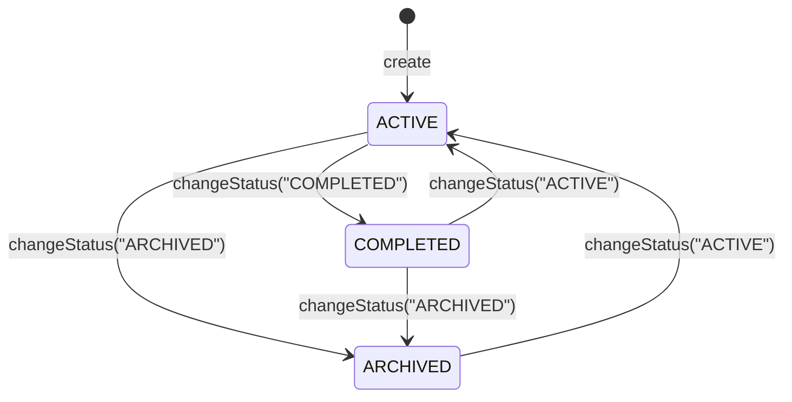

# Your First Domain Entity

Posts 01 through 06 built the infrastructure: schema isolation, request routing, the Gateway
BFF, tenant provisioning, and member sync. Now we actually build something a user cares about.

The `Project` entity is the first domain object in the template, and it's designed to be the
pattern you copy for every entity that follows. **If you're extending this template with your
own domain, start here.**

---

## The Entity

`backend/src/main/java/io/github/rakheendama/starter/project/Project.java`:

```java
@Entity
@Table(name = "projects")
public class Project {

  @Id
  @GeneratedValue(strategy = GenerationType.UUID)
  private UUID id;

  @Column(name = "title", nullable = false, length = 255)
  private String title;

  @Column(name = "description", columnDefinition = "TEXT")
  private String description;

  @Column(name = "status", nullable = false, length = 20)
  private String status;

  @Column(name = "customer_id", nullable = false)
  private UUID customerId;

  @Column(name = "created_by")
  private UUID createdBy;

  @Column(name = "created_at", nullable = false, updatable = false)
  private Instant createdAt;

  @Column(name = "updated_at", nullable = false)
  private Instant updatedAt;

  protected Project() {}

  public Project(String title, String description, UUID customerId, UUID createdBy) {
    this.title = title;
    this.description = description;
    this.customerId = customerId;
    this.createdBy = createdBy;
    this.status = "ACTIVE";
    this.createdAt = Instant.now();
    this.updatedAt = Instant.now();
  }
}
```

Key conventions:

- **No Lombok.** Java records handle DTOs. Entities use explicit fields and getters.
- **`protected` no-arg constructor.** JPA requires it; `protected` prevents accidental use.
- **Mutation methods, not setters.** `updateDetails()` and `changeStatus()` express domain
  operations. There's no `setTitle()` — you update the title and description together because
  that's how the UI works.
- **`createdAt` is `updatable = false`.** Once set, it never changes.
- **No `@ManyToOne` to `Customer`.** We store the `customerId` UUID directly. The entity
  doesn't need to load the full customer graph for most operations. When you need the
  customer, query it explicitly.

---

## Status Transitions

```java
public void changeStatus(String newStatus) {
  Set<String> validTargets =
      switch (this.status) {
        case "ACTIVE" -> Set.of("COMPLETED", "ARCHIVED");
        case "COMPLETED" -> Set.of("ARCHIVED", "ACTIVE");
        case "ARCHIVED" -> Set.of("ACTIVE");
        default -> Set.of();
      };
  if (!validTargets.contains(newStatus)) {
    throw new InvalidStateException(
        "Invalid project status transition",
        "Cannot transition from " + this.status + " to " + newStatus);
  }
  this.status = newStatus;
  this.updatedAt = Instant.now();
}
```



The state machine lives in the entity, not the service. This means you can't accidentally
bypass it — every path through the codebase that changes a project's status goes through
`changeStatus()`, which validates the transition.

---

## The Repository

`backend/src/main/java/io/github/rakheendama/starter/project/ProjectRepository.java`:

```java
public interface ProjectRepository extends JpaRepository<Project, UUID> {
  List<Project> findByCustomerId(UUID customerId);
  List<Project> findByStatus(String status);
  List<Project> findByCustomerIdAndStatus(UUID customerId, String status);
}
```

Notice what's missing: **no `WHERE tenant_id = ?` clauses.** The multitenancy core
(see [Post 03](./03-the-multitenancy-core.md)) already set `search_path` to the tenant's
schema before any query executes. `findAll()` returns only this tenant's projects. Full stop.

> **Copy this pattern.** Every new repository in the template is a plain `JpaRepository`
> with domain-specific finder methods. No multitenancy boilerplate. No filters. No aspects.

---

## The Service

`backend/src/main/java/io/github/rakheendama/starter/project/ProjectService.java`:

```java
@Service
public class ProjectService {

  private final ProjectRepository repository;
  private final CustomerRepository customerRepository;

  @Transactional
  public Project createProject(String title, String description, UUID customerId) {
    RequestScopes.requireOwner();
    customerRepository.findById(customerId)
        .orElseThrow(() -> new ResourceNotFoundException("Customer", customerId));
    UUID createdBy = RequestScopes.requireMemberId();
    var project = new Project(title, description, customerId, createdBy);
    return repository.save(project);
  }

  @Transactional
  public Project updateProject(UUID id, String title, String description) {
    RequestScopes.requireOwner();
    var project = repository.findById(id)
        .orElseThrow(() -> new ResourceNotFoundException("Project", id));
    project.updateDetails(title, description);
    return repository.save(project);
  }

  @Transactional
  public Project changeProjectStatus(UUID id, String newStatus) {
    RequestScopes.requireOwner();
    var project = repository.findById(id)
        .orElseThrow(() -> new ResourceNotFoundException("Project", id));
    project.changeStatus(newStatus);
    return repository.save(project);
  }
}
```

Three patterns to copy:

1. **`@Transactional` on writes.** Reads use `@Transactional(readOnly = true)`.
2. **`RequestScopes.requireOwner()`** as the first line of any owner-only operation.
3. **`RequestScopes.requireMemberId()`** to stamp `createdBy` — the current member's UUID,
   read from the ScopedValue bound by `MemberFilter`.

---

## The Controller

`backend/src/main/java/io/github/rakheendama/starter/project/ProjectController.java`:

```java
@RestController
@RequestMapping("/api/projects")
public class ProjectController {

  @PostMapping
  public ResponseEntity<ProjectResponse> createProject(
      @Valid @RequestBody CreateProjectRequest request) {
    var project = projectService.createProject(
        request.title(), request.description(), request.customerId());
    return ResponseEntity.created(URI.create("/api/projects/" + project.getId()))
        .body(ProjectResponse.from(project));
  }

  @GetMapping("/{id}")
  public ResponseEntity<ProjectResponse> getProject(@PathVariable UUID id) {
    return ResponseEntity.ok(ProjectResponse.from(projectService.getProject(id)));
  }

  @DeleteMapping("/{id}")
  public ResponseEntity<ProjectResponse> archiveProject(@PathVariable UUID id) {
    return ResponseEntity.ok(ProjectResponse.from(projectService.archiveProject(id)));
  }

  record CreateProjectRequest(
      @NotBlank(message = "title is required") @Size(max = 255) String title,
      @Size(max = 2000) String description,
      @NotNull(message = "customerId is required") UUID customerId) {}

  record ProjectResponse(
      UUID id, String title, String description, String status,
      UUID customerId, UUID createdBy, Instant createdAt, Instant updatedAt) {
    static ProjectResponse from(Project p) {
      return new ProjectResponse(p.getId(), p.getTitle(), p.getDescription(),
          p.getStatus(), p.getCustomerId(), p.getCreatedBy(),
          p.getCreatedAt(), p.getUpdatedAt());
    }
  }
}
```

DTOs are Java records defined as inner classes of the controller. Request records carry
validation annotations (`@NotBlank`, `@Size`, `@NotNull`). Response records have a `from()`
factory method that maps from the entity.

The `@PostMapping` returns `201 Created` with a `Location` header via
`ResponseEntity.created(URI.create(...))`. This is a small thing, but it's the REST convention
and it costs nothing to get right from the start.

---

## The Migration

`backend/src/main/resources/db/migration/tenant/V4__create_projects.sql`:

```sql
CREATE TABLE projects (
    id          UUID PRIMARY KEY DEFAULT gen_random_uuid(),
    title       VARCHAR(255) NOT NULL,
    description TEXT,
    status      VARCHAR(20) NOT NULL DEFAULT 'ACTIVE',
    customer_id UUID NOT NULL REFERENCES customers(id),
    created_by  UUID REFERENCES members(id),
    created_at  TIMESTAMPTZ NOT NULL DEFAULT now(),
    updated_at  TIMESTAMPTZ NOT NULL DEFAULT now()
);

CREATE INDEX idx_projects_customer_id ON projects (customer_id);
CREATE INDEX idx_projects_status ON projects (status);
```

The FK to `customers(id)` enforces referential integrity at the database level. The
`idx_projects_customer_id` index supports the `findByCustomerId` query. Both are in the
tenant schema — Flyway runs this migration once per schema during provisioning.

---

## The Integration Test

`backend/src/test/java/io/github/rakheendama/starter/project/ProjectIntegrationTest.java`:

```java
@SpringBootTest
@AutoConfigureMockMvc
@Import(TestcontainersConfiguration.class)
@ActiveProfiles("test")
@TestInstance(TestInstance.Lifecycle.PER_CLASS)
class ProjectIntegrationTest {

  @Autowired private MockMvc mockMvc;
  @Autowired private TenantProvisioningService tenantProvisioningService;
  @MockitoBean private KeycloakProvisioningClient keycloakProvisioningClient;

  @BeforeAll
  void provisionTenant() {
    orgSlug = "test-org-" + UUID.randomUUID().toString().substring(0, 8);
    tenantProvisioningService.provisionTenant(orgSlug, "Test Org", "kc-" + orgSlug);
  }

  @BeforeEach
  void setUp() {
    ScopedValue.where(RequestScopes.TENANT_ID, schemaName)
        .where(RequestScopes.ORG_ID, orgSlug)
        .run(() -> {
            projectRepository.deleteAll();
            // seed members, customers...
        });
  }
}
```

Four things to notice:

1. **`@Import(TestcontainersConfiguration.class)`** — spins up a real PostgreSQL container.
   No H2, no mocks for the database.
2. **`@MockitoBean` for `KeycloakProvisioningClient`** — the Keycloak Admin API is mocked.
   Tests should not depend on a running Keycloak instance.
3. **`ScopedValue.where().run()`** for test setup — routes setup queries to the correct tenant
   schema. No `@AfterEach` cleanup needed; the ScopedValue unbinds automatically.
4. **Real tenant provisioning in `@BeforeAll`** — each test class gets its own schema, ensuring
   complete isolation between test classes.

Here's a test that verifies RBAC:

```java
@Test
void createProject_memberRole_returns403() throws Exception {
  mockMvc.perform(
      post("/api/projects")
          .contentType(MediaType.APPLICATION_JSON)
          .content("""
              { "title": "Blocked", "customerId": "%s" }
              """.formatted(customerId))
          .with(memberJwt()))
      .andExpect(status().isForbidden());
}
```

And one that proves tenant isolation:

```java
@Test
void tenantIsolation_projectInTenantANotVisibleFromTenantB() throws Exception {
  // Seed project in tenant A, provision tenant B,
  // assert that tenant B sees 0 projects
  mockMvc.perform(get("/api/projects").with(tenantBJwt()))
      .andExpect(status().isOk())
      .andExpect(jsonPath("$.length()").value(0));
}
```

> **Copy this pattern.** Every new entity gets a similar integration test: provision a tenant,
> seed data via ScopedValues, test happy paths with owner JWT, test RBAC with member JWT,
> test isolation across tenants.

---

## What's Next

We have a working domain entity with full CRUD, RBAC, tenant isolation, and integration tests.
In [Post 08: Security Hardening](./08-security-hardening.md), we'll look at the cross-cutting
security properties built into the template — schema name validation, OTP security, magic link
token design, CSRF strategy, and JWT validation layers.

---

*This is post 7 of 10 in the **Zero to Prod: Multitenant SaaS with Java 25, Keycloak & Spring Boot 4** series.*
