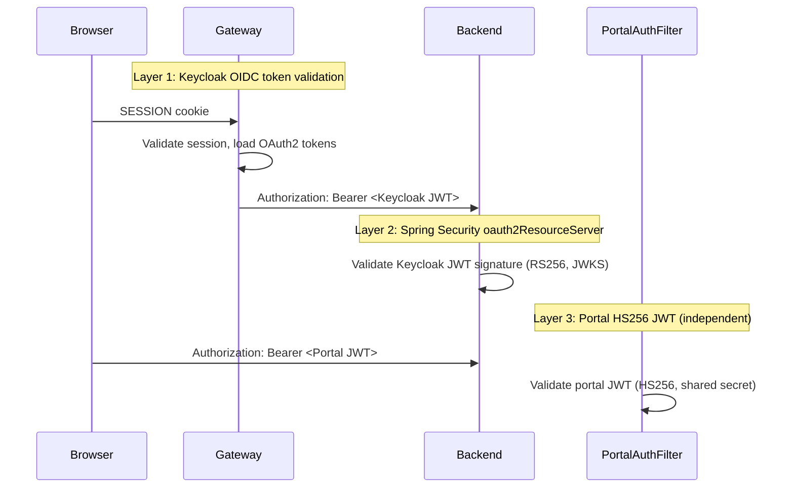

# Security Hardening

Most starter templates ship with auth wired up and call it done. But authentication is the
easy part. The hard part is all the places where a clever attacker can slip between the cracks:
SQL injection via schema names, timing attacks on OTP verification, token reuse on magic links,
information leaks from error messages.

This post catalogues the security properties baked into the template — not as aspirational
goals, but as implemented code you can read and audit.

---

## Schema Name Validation — SQL Injection Guard

The multitenancy core sets `search_path` to a tenant schema on every connection. If an attacker
could control the schema name, they could inject arbitrary SQL. The defense is a strict regex
validation in `SchemaMultiTenantConnectionProvider`.

`backend/src/main/java/io/github/rakheendama/starter/multitenancy/SchemaMultiTenantConnectionProvider.java`:

```java
private static final Pattern SCHEMA_PATTERN = Pattern.compile("^tenant_[0-9a-f]{12}$");

private void sanitizeSchema(String schema) {
  if ("public".equals(schema) || SCHEMA_PATTERN.matcher(schema).matches()) {
    return schema;
  }
  throw new IllegalArgumentException("Invalid schema name: " + schema);
}
```

Schema names must be either `"public"` or match `tenant_` followed by exactly 12 lowercase
hex characters. The schema name is derived from `SchemaNameGenerator`, which takes the
SHA-256 hash of the org slug and truncates to 12 hex chars. This is deterministic and
cannot be influenced by user input at runtime.

> **What if someone tampers with the `org_id` JWT claim?** The claim is validated by
> `TenantFilter`, which looks up the org in `OrgSchemaMappingRepository`. A tampered claim
> either matches an existing org (the user has legitimate access) or matches nothing
> (403 Forbidden). The schema name is resolved server-side — the client never sends it.

---

## OTP Security Properties

The access request flow (see [Post 05](./05-tenant-registration-pipeline.md)) uses a 6-digit
OTP for email verification. Here's why each design choice matters.

### Generation

`backend/src/main/java/io/github/rakheendama/starter/accessrequest/OtpService.java`:

```java
private final SecureRandom secureRandom = SecureRandom.getInstanceStrong();

public String generateOtp() {
  return String.format("%06d", secureRandom.nextInt(1_000_000));
}
```

`SecureRandom.getInstanceStrong()` uses the OS-level entropy source (`/dev/random` on Linux,
`SecureRandom` backed by the platform's strongest CSPRNG). The 6-digit format gives 1,000,000
possible values — adequate when combined with attempt limits and TTLs.

### Storage

```java
public String hashOtp(String otp) {
  return passwordEncoder.encode(otp);  // BCrypt, work factor 10
}
```

The raw OTP is never persisted. Only the BCrypt hash is stored in `access_requests.otp_hash`.
If the database is compromised, an attacker cannot recover valid OTPs.

### Verification

```java
@Transactional(noRollbackFor = {InvalidStateException.class})
public VerifyOtpResponse verifyOtp(String email, String otp) {
    // ...
    entity.setOtpAttempts(entity.getOtpAttempts() + 1);
    accessRequestRepository.save(entity);

    if (!otpService.verifyOtp(otp, entity.getOtpHash())) {
        throw new InvalidStateException("Invalid OTP", "The verification code is incorrect");
    }

    entity.setOtpHash(null);  // hash cleared on success
    // ...
}
```

Three security properties in this method:

| Property | Implementation | Why |
|----------|---------------|-----|
| Counter before BCrypt | `setOtpAttempts(+1)` and `save()` before `verifyOtp()` | Timing attack prevention — both the valid and invalid paths hit the expensive BCrypt comparison |
| Persistent failure counter | `noRollbackFor = {InvalidStateException.class}` | Failed attempts still commit the incremented counter — can't bypass by causing a rollback |
| Hash cleared on success | `setOtpHash(null)` | Reduces the data exposure window — a successful OTP can never be replayed |

---

## Magic Link Security Properties

The customer portal uses magic links instead of passwords (see
[Post 09](./09-the-magic-link-portal.md) for the full flow). The security design is more
involved than the OTP because magic links travel through email and are clicked in browsers.

### Token Generation

`backend/src/main/java/io/github/rakheendama/starter/portal/MagicLinkService.java`:

```java
private static final int TOKEN_BYTES = 32;

byte[] tokenBytes = new byte[TOKEN_BYTES];
secureRandom.nextBytes(tokenBytes);
String rawToken = Base64.getUrlEncoder().withoutPadding().encodeToString(tokenBytes);
```

32 bytes of `SecureRandom` output = **256 bits of entropy**, Base64-URL encoded. This is
well above the 128-bit minimum recommended by OWASP for session tokens.

### Hash-Before-Store

```java
String tokenHash = hashToken(rawToken);
// Only the hash is persisted
tokenRepository.save(new MagicLinkToken(customerId, orgId, tokenHash, expiresAt, clientIp));
```

The raw token exists in memory only during generation and in the email body. The database
stores a SHA-256 hash. If `public.magic_link_tokens` is compromised, an attacker cannot
reconstruct valid tokens.

```java
static String hashToken(String rawToken) {
  MessageDigest digest = MessageDigest.getInstance("SHA-256");
  byte[] hashBytes = digest.digest(rawToken.getBytes(StandardCharsets.UTF_8));
  return HexFormat.of().formatHex(hashBytes);
}
```

### Single-Use Exchange with Pessimistic Locking

`backend/src/main/java/io/github/rakheendama/starter/portal/MagicLinkTokenRepository.java`:

```java
@Lock(LockModeType.PESSIMISTIC_WRITE)
@Query("SELECT t FROM MagicLinkToken t WHERE t.tokenHash = :tokenHash")
Optional<MagicLinkToken> findByTokenHashForUpdate(@Param("tokenHash") String tokenHash);
```

The exchange endpoint uses `SELECT FOR UPDATE` to prevent a race condition where two
concurrent requests could both read the token before either marks it used. The pessimistic
lock serializes access — the second request blocks until the first commits, then sees
`isUsed() == true` and fails.

```java
@Transactional
public ExchangeResult exchangeToken(String rawToken) {
  String tokenHash = hashToken(rawToken);
  MagicLinkToken token = tokenRepository.findByTokenHashForUpdate(tokenHash)
      .orElseThrow(() -> new PortalAuthException("Invalid magic link token"));

  if (token.isExpired()) throw new PortalAuthException("Magic link has expired");
  if (token.isUsed()) throw new PortalAuthException("Magic link has already been used");

  token.markUsed();
  tokenRepository.save(token);
  return new ExchangeResult(token.getCustomerId(), token.getOrgId());
}
```

### Rate Limiting

```java
long recentCount = tokenRepository.countByCustomerIdAndCreatedAtAfter(
    customerId, Instant.now().minus(5, ChronoUnit.MINUTES));
if (recentCount >= MAX_TOKENS_PER_5_MINUTES) {  // MAX_TOKENS_PER_5_MINUTES = 3
  throw new TooManyRequestsException("Too many login attempts. Please try again later.");
}
```

3 tokens per customer per 5-minute window. Simple, effective, database-enforced.

### Summary of Magic Link Properties

| Property | Value | Mechanism |
|----------|-------|-----------|
| Entropy | 256 bits | 32 bytes `SecureRandom`, Base64-URL |
| Storage | Hash only | SHA-256, raw token never persisted |
| Single-use | Yes | `PESSIMISTIC_WRITE` + `markUsed()` |
| TTL | 15 minutes | `expiresAt` check on exchange |
| Rate limit | 3 per customer per 5 min | Count query on `created_at` |
| IP tracking | Yes | `created_ip` logged for audit |

---

## JWT Validation Layers

The template has three independent JWT validation paths:



1. **Gateway** — validates Keycloak OIDC tokens before they reach the backend. Invalid tokens
   are rejected at the edge.
2. **Backend `SecurityConfig`** — configures `oauth2ResourceServer(oauth2 -> oauth2.jwt(...))`
   as a second independent validation layer. Even if the Gateway is bypassed (direct backend
   access), the backend independently validates the JWT signature against Keycloak's JWKS
   endpoint.
3. **`PortalAuthFilter`** — validates portal JWTs using HS256 with a dedicated secret. This
   is completely separate from the Keycloak JWT path. Different key, different algorithm,
   different filter chain.

---

## Session Management

`backend/src/main/java/io/github/rakheendama/starter/config/SecurityConfig.java`:

```java
.sessionManagement(session -> session.sessionCreationPolicy(SessionCreationPolicy.STATELESS))
```

The backend creates no HTTP sessions. Every request is authenticated via its JWT. Sessions
live in the Gateway, where Spring Session manages them with secure cookies
(`HttpOnly`, `SameSite=Lax`).

---

## CSRF Strategy

```java
.csrf(csrf -> csrf.disable())
```

CSRF is disabled on the backend because it's a stateless API-only service. The backend doesn't
serve HTML and doesn't use cookies for authentication — it receives JWTs via `Authorization`
headers. CSRF protection is the Gateway's responsibility (see
[Post 04](./04-spring-cloud-gateway-as-bff.md)), where it's enforced on the session-based
OAuth2 flow.

> **Why not enable CSRF on both?** CSRF tokens require server-side session state. The backend
> is stateless by design — `SessionCreationPolicy.STATELESS` means there's no session to
> anchor a CSRF token to. The Gateway, which maintains sessions, is the right place for CSRF.

---

## Anti-Enumeration

`backend/src/main/java/io/github/rakheendama/starter/portal/PortalAuthController.java`:

```java
private static final String GENERIC_MESSAGE = "If an account exists, a link has been sent.";

@PostMapping("/request-link")
public ResponseEntity<MessageResponse> requestLink(...) {
  // ... resolve org, look up customer ...
  if (resolvedId[0] != null) {
    magicLinkService.generateToken(resolvedId[0], body.orgId(), request.getRemoteAddr());
  }
  return ResponseEntity.ok(new MessageResponse(GENERIC_MESSAGE));  // always same response
}
```

Whether the email exists or not, the response is identical: `200 OK` with the same message.
An attacker probing for valid customer emails gets no signal — same HTTP status, same body,
same response time (the `generateToken` call is fast regardless).

This pattern applies to both the "org not found" and "customer not found" paths. The early
return for a missing org also returns `200 OK` with `GENERIC_MESSAGE`.

---

## Portal Cross-Customer Access

`backend/src/main/java/io/github/rakheendama/starter/portal/PortalController.java`:

```java
private Project findOwnedProject(UUID projectId, UUID customerId) {
  return projectRepository.findById(projectId)
      .filter(p -> customerId.equals(p.getCustomerId()))
      .orElseThrow(() -> new ResourceNotFoundException("Project", projectId));
}
```

When a customer requests a project that belongs to a different customer, they get `404 Not
Found` — not `403 Forbidden`. Returning 403 would confirm the project exists. Returning 404
reveals nothing.

---

## What's Next

With the security properties documented, it's time to build the feature that uses most of
them. In [Post 09: The Magic Link Portal](./09-the-magic-link-portal.md), we'll walk through
the full customer portal authentication flow — from magic link request to portal JWT to
scoped data access.

---

*This is post 8 of 10 in the **Zero to Prod: Multitenant SaaS with Java 25, Keycloak & Spring Boot 4** series.*
