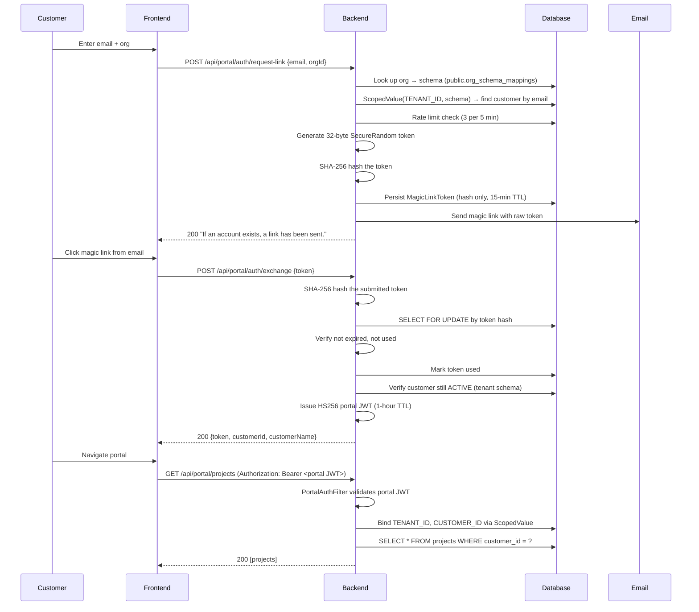

# The Magic Link Portal

Customers are not Keycloak users. They don't have passwords. They don't log in through the
Gateway's OAuth2 flow. Instead, they request a magic link by email, click it, and get a
short-lived portal JWT. This is a deliberate architectural decision documented in
[ADR-T005: Magic Links Over Customer Accounts](../adr/ADR-T005-magic-links-over-customer-accounts.md).

The upside: no password management, no Keycloak account bloat, no identity provider coupling
for portal access. The downside: every session starts with an email. That's an acceptable
trade-off for infrequent portal visits.

Let's trace the full flow.

---

## The Full Sequence



Three phases: request link, exchange token, use portal. Each phase has distinct security
boundaries and scope transitions.

---

## Phase 1: Request Link

`backend/src/main/java/io/github/rakheendama/starter/portal/PortalAuthController.java`:

```java
@PostMapping("/request-link")
public ResponseEntity<MessageResponse> requestLink(
    @Valid @RequestBody RequestLinkRequest body, HttpServletRequest request) {

  String schema = orgSchemaMappingRepository.findByOrgId(body.orgId())
      .map(OrgSchemaMapping::getSchemaName).orElse(null);
  if (schema == null) {
    return ResponseEntity.ok(new MessageResponse(GENERIC_MESSAGE));
  }

  final UUID[] resolvedId = {null};
  ScopedValue.where(RequestScopes.TENANT_ID, schema).run(() -> {
      customerRepository.findByEmail(body.email())
          .filter(c -> "ACTIVE".equals(c.getStatus()))
          .ifPresent(c -> resolvedId[0] = c.getId());
  });

  if (resolvedId[0] != null) {
    magicLinkService.generateToken(resolvedId[0], body.orgId(), request.getRemoteAddr());
  }

  return ResponseEntity.ok(new MessageResponse(GENERIC_MESSAGE));
}
```

Notice the scope transitions:

1. **Public schema** — look up the org-to-schema mapping (this is a public table)
2. **Tenant schema** — `ScopedValue.where(TENANT_ID, schema).run(...)` to find the customer
   by email within the tenant's `customers` table
3. **Back to public schema** — `generateToken()` runs outside the tenant scope because
   `magic_link_tokens` is a public table (magic links span tenants conceptually — the token
   needs the org ID to route back to the correct tenant on exchange)

The response is always `200 OK` with the same generic message, regardless of whether the
org exists, the customer exists, or the customer is active. See
[Post 08](./08-security-hardening.md) for why.

---

## Phase 2: Token Generation

`backend/src/main/java/io/github/rakheendama/starter/portal/MagicLinkService.java`:

```java
private TokenGenerationResult persistToken(UUID customerId, String orgId, String clientIp) {
  return transactionTemplate.execute(status -> {
    // 1. Rate limit
    long recentCount = tokenRepository.countByCustomerIdAndCreatedAtAfter(
        customerId, Instant.now().minus(5, ChronoUnit.MINUTES));
    if (recentCount >= MAX_TOKENS_PER_5_MINUTES) {
      throw new TooManyRequestsException("Too many login attempts...");
    }

    // 2. Generate
    byte[] tokenBytes = new byte[TOKEN_BYTES];  // 32 bytes
    secureRandom.nextBytes(tokenBytes);
    String rawToken = Base64.getUrlEncoder().withoutPadding().encodeToString(tokenBytes);

    // 3. Hash
    String tokenHash = hashToken(rawToken);

    // 4. Persist (hash only)
    Instant expiresAt = Instant.now().plus(TOKEN_TTL_MINUTES, ChronoUnit.MINUTES);
    tokenRepository.save(new MagicLinkToken(customerId, orgId, tokenHash, expiresAt, clientIp));

    // 5. Return raw (only time it leaves memory)
    return new TokenGenerationResult(rawToken);
  });
}
```

The raw token leaves this method exactly once — to be embedded in the email. After that, only
the SHA-256 hash exists.

---

## Phase 3: Token Exchange

```java
@Transactional
public ExchangeResult exchangeToken(String rawToken) {
  String tokenHash = hashToken(rawToken);
  MagicLinkToken token = tokenRepository.findByTokenHashForUpdate(tokenHash)
      .orElseThrow(() -> new PortalAuthException("Invalid magic link token"));

  if (token.isExpired()) throw new PortalAuthException("Magic link has expired");
  if (token.isUsed()) throw new PortalAuthException("Magic link has already been used");

  token.markUsed();
  tokenRepository.save(token);

  return new ExchangeResult(token.getCustomerId(), token.getOrgId());
}
```

The `findByTokenHashForUpdate` query uses `@Lock(LockModeType.PESSIMISTIC_WRITE)` — a
`SELECT FOR UPDATE` that serializes concurrent exchange attempts on the same token. Without
this, two near-simultaneous clicks could both pass the `isUsed()` check before either commits.

---

## The Portal JWT

`backend/src/main/java/io/github/rakheendama/starter/portal/PortalJwtService.java`:

```java
public String issueToken(UUID customerId, String orgId) {
  Instant now = Instant.now();
  var claims = new JWTClaimsSet.Builder()
      .jwtID(UUID.randomUUID().toString())
      .subject(customerId.toString())
      .claim("org_id", orgId)
      .claim("type", "customer")
      .issueTime(Date.from(now))
      .expirationTime(Date.from(now.plus(SESSION_TTL)))  // 1 hour
      .build();
  var signedJwt = new SignedJWT(new JWSHeader(JWSAlgorithm.HS256), claims);
  signedJwt.sign(new MACSigner(secret));
  return signedJwt.serialize();
}
```

This JWT is completely independent of Keycloak:

| Property | Keycloak JWT | Portal JWT |
|----------|-------------|------------|
| Issuer | Keycloak server | Backend directly |
| Algorithm | RS256 (asymmetric) | HS256 (symmetric) |
| Key | Keycloak's RSA key pair | `portal.jwt.secret` property |
| Subject | Keycloak user ID | Customer UUID |
| Validated by | Gateway + Backend `SecurityConfig` | `PortalAuthFilter` |
| TTL | Keycloak-configured | 1 hour |

> **Why a separate secret?** Portal customers are not Keycloak users. Using the same key
> would mean a compromised portal secret could forge member JWTs (or vice versa). Separate
> keys, separate algorithms, independent revocation surfaces.

The `type: "customer"` claim is checked during validation — a Keycloak JWT (which lacks this
claim) cannot be used to access portal endpoints, even if the HS256 secret were somehow known.

---

## PortalAuthFilter — Binding the Customer Context

`backend/src/main/java/io/github/rakheendama/starter/portal/PortalAuthFilter.java`:

```java
@Override
protected void doFilterInternal(
    HttpServletRequest request, HttpServletResponse response, FilterChain filterChain)
    throws ServletException, IOException {

  String token = extractBearerToken(request);
  PortalJwtService.PortalClaims claims = portalJwtService.validateToken(token);

  String schema = mappingRepository.findByOrgId(claims.orgId())
      .map(OrgSchemaMapping::getSchemaName).orElse(null);
  if (schema == null) {
    response.sendError(HttpServletResponse.SC_UNAUTHORIZED, "Organization not found");
    return;
  }

  var carrier = ScopedValue.where(RequestScopes.TENANT_ID, schema)
      .where(RequestScopes.ORG_ID, claims.orgId())
      .where(RequestScopes.CUSTOMER_ID, claims.customerId());

  ScopedFilterChain.runScoped(carrier, filterChain, request, response);
}
```

The filter binds three ScopedValues: `TENANT_ID` (for schema routing), `ORG_ID`, and
`CUSTOMER_ID`. Downstream controllers read `CUSTOMER_ID` to scope queries.

Note what's different from the member filter chain: there's no `MEMBER_ID` or `ORG_ROLE`
bound. Portal requests have a customer context, not a member context. The two paths never
overlap.

---

## Portal Endpoints — Scoped Access

`backend/src/main/java/io/github/rakheendama/starter/portal/PortalController.java`:

```java
@GetMapping("/projects")
public ResponseEntity<List<PortalProjectResponse>> listProjects() {
  UUID customerId = RequestScopes.CUSTOMER_ID.get();
  var projects = projectRepository.findByCustomerId(customerId);
  return ResponseEntity.ok(projects.stream().map(PortalProjectResponse::from).toList());
}

@GetMapping("/projects/{id}")
public ResponseEntity<PortalProjectResponse> getProject(@PathVariable UUID id) {
  UUID customerId = RequestScopes.CUSTOMER_ID.get();
  var project = findOwnedProject(id, customerId);
  return ResponseEntity.ok(PortalProjectResponse.from(project));
}

private Project findOwnedProject(UUID projectId, UUID customerId) {
  return projectRepository.findById(projectId)
      .filter(p -> customerId.equals(p.getCustomerId()))
      .orElseThrow(() -> new ResourceNotFoundException("Project", projectId));
}
```

Two layers of isolation:

1. **Schema isolation** — `TENANT_ID` routes queries to the correct tenant schema
2. **Customer scoping** — `findByCustomerId` and `findOwnedProject` ensure a customer only
   sees their own projects. Cross-customer access returns `404 Not Found`, not `403 Forbidden`.

---

## The MagicLinkToken Entity

`backend/src/main/java/io/github/rakheendama/starter/portal/MagicLinkToken.java`:

```java
@Entity
@Table(name = "magic_link_tokens", schema = "public")
public class MagicLinkToken {

  @Column(name = "token_hash", nullable = false, length = 255)
  private String tokenHash;       // SHA-256 hex — raw token NEVER stored

  @Column(name = "customer_id", nullable = false)
  private UUID customerId;

  @Column(name = "org_id", nullable = false, length = 255)
  private String orgId;

  @Column(name = "expires_at", nullable = false)
  private Instant expiresAt;

  @Column(name = "used_at")
  private Instant usedAt;         // null = not yet used

  public void markUsed() { this.usedAt = Instant.now(); }
  public boolean isExpired() { return Instant.now().isAfter(expiresAt); }
  public boolean isUsed() { return usedAt != null; }
}
```

Note `schema = "public"` — this entity lives in the public schema, not in any tenant schema.
Magic link tokens need to be resolvable before we know which tenant schema to use (the
token itself carries the `orgId` that resolves to a schema).

---

## What's Next

We have the portal authenticated and customers viewing their projects. But a read-only portal
isn't very useful. In [Post 10: Portal Comments — Dual-Auth Writes](./10-portal-comments-dual-auth-writes.md),
we'll build a comment system where both team members (Keycloak-authenticated) and customers
(portal-authenticated) can write to the same timeline — a single table, two auth paths, one
unified query.

---

*This is post 9 of 10 in the **Zero to Prod: Multitenant SaaS with Java 25, Keycloak & Spring Boot 4** series.*
